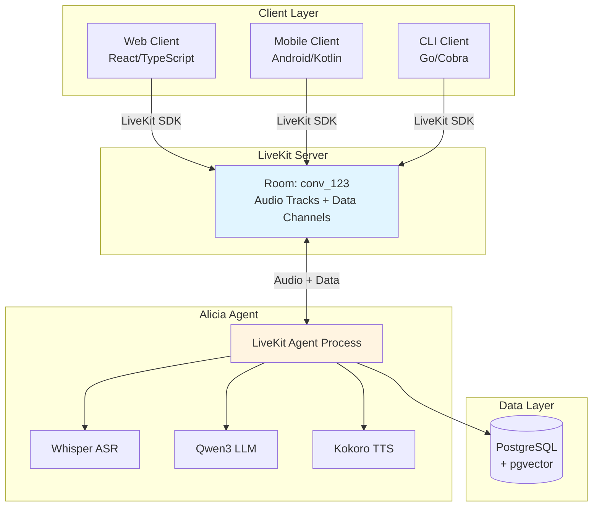
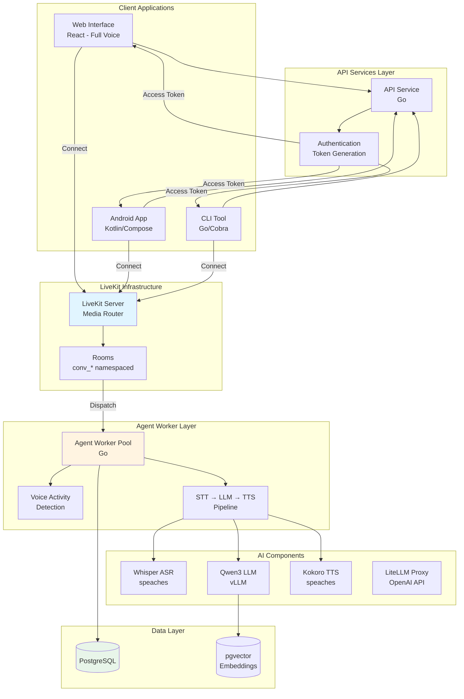
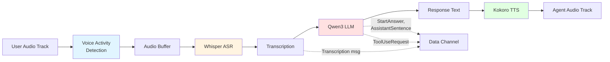
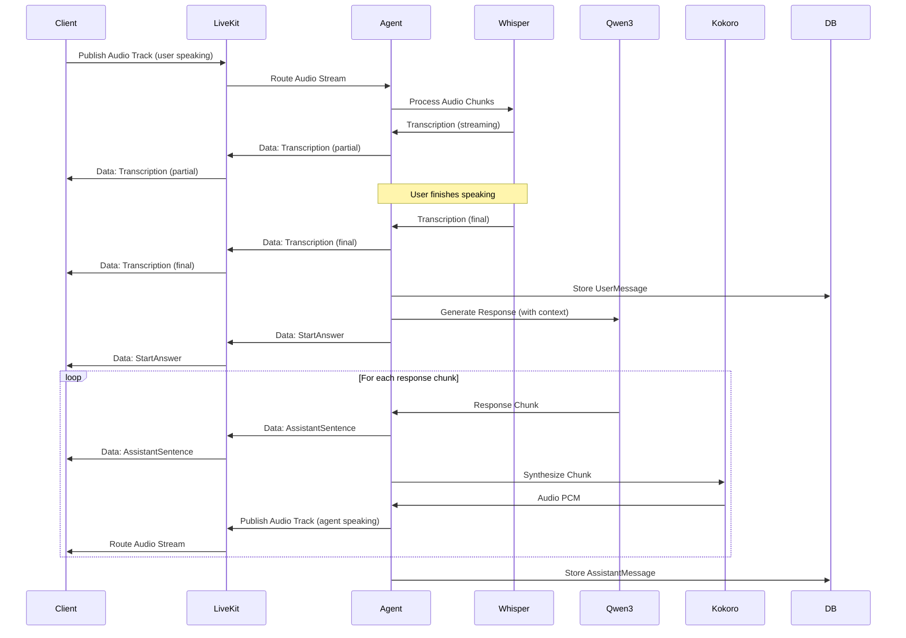
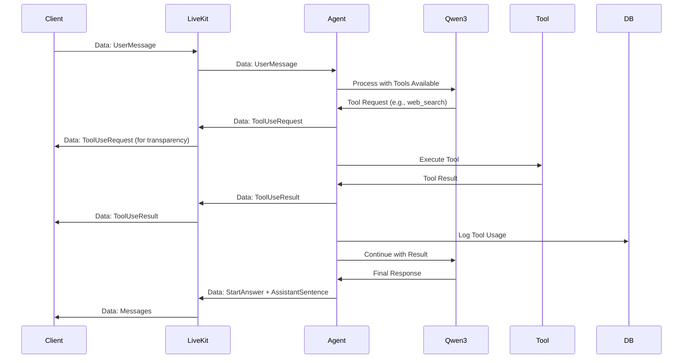

# Alicia Architecture

This document describes the architecture of Alicia, a real-time voice assistant that enables natural conversations through audio. Alicia uses LiveKit as its real-time communication layer to provide seamless, streaming conversations with AI across web, mobile, and command-line interfaces.

> **Note**: This document describes both implemented and planned features. See the [Implementation Status](#implementation-status) section below for details on what is currently available.

## System Overview

Alicia is a multi-platform voice assistant that provides real-time, streaming conversations with AI. The system combines speech recognition (Whisper), language understanding (Qwen3), and voice synthesis (Kokoro) to create a seamless conversational experience. LiveKit serves as the central communication hub, handling all real-time audio streaming and protocol message delivery.



### Key Architecture Principles

1. **LiveKit as Communication Backbone**: All real-time communication flows through LiveKit, providing battle-tested media transport, NAT traversal, and multi-platform support.

2. **One Room Per Conversation**: Each conversation maps to exactly one LiveKit room (`conv_{conversation_id}`), providing natural isolation and lifecycle management.

3. **Dual Transport Channels**:
   - **Audio tracks** carry voice (user microphone → agent, agent TTS → user)
   - **Data channels** carry protocol messages (all 16 message types, MessagePack-encoded)

4. **Agent as Participant**: The Alicia agent joins rooms as participant `alicia_agent`, processing audio and generating responses in real-time.

5. **Client Flexibility**: Clients can be voice-only, text-only, or multimodal, all using the same underlying infrastructure.

## Technology Stack

### Core Technologies

1. **Real-Time Communication**:
   - **LiveKit Server**: Central hub for WebRTC-based real-time audio and data transport
   - **LiveKit Client SDKs**: Web (TypeScript), Android (Kotlin), CLI (Go)
   - **LiveKit Agents Framework**: Framework for building AI agents

2. **Backend Language & Tools**:
   - Go 1.25+ (API services, CLI client, conversation management, agent worker)
   - golangci-lint (static code analysis)

3. **Database & Storage**:
   - PostgreSQL 15+ with pgvector extension (vector embeddings)
   - sqlc (type-safe database access for Go)
   - pgx (PostgreSQL driver)
   - migrate (database migrations)

4. **Protocol & Serialization**:
   - MessagePack (binary protocol implementation as specified in PROTOCOL.md)
   - All 16 message types flow over LiveKit data channels

5. **AI Models & Integration**:
   - Whisper (speech recognition via speaches server)
   - Qwen3-8B-AWQ (language understanding via vLLM server)
   - Kokoro TTS (voice synthesis via speaches server)
   - LiteLLM (OpenAI-compatible API proxy)

6. **Observability**:
   - OpenTelemetry (distributed tracing)
   - Prometheus (metrics)
   - zap (structured logging)

### Audio Formats

- **Input/Output**: Opus codec at 48kHz (LiveKit negotiated)
- **Internal Processing**: 16kHz PCM for Whisper
- **TTS Output**: 24kHz mono for Kokoro (resampled to 48kHz for LiveKit)

## System Architecture

### High-Level Component View



## LiveKit Communication Layer

### Room Model

Each Alicia conversation corresponds to exactly one LiveKit room. This provides:

- **Isolation**: Conversations cannot interfere with each other
- **Security**: Access controlled via per-room JWT tokens
- **Lifecycle Management**: Rooms automatically clean up when empty
- **Reconnection**: Clients can rejoin rooms with state preserved

**Room Naming Convention**:
```
Room Name: conv_{conversation_id}
Example:   conv_k9mX2pL7qR
```

Where `conversation_id` is a NanoID from the `alicia_conversations.id` column.

**Room Configuration**:
```go
room, err := livekitAPI.Room.CreateRoom(ctx, &livekit.CreateRoomRequest{
    Name:            fmt.Sprintf("conv_%s", conversationID),
    EmptyTimeout:    300,        // 5 min after last participant leaves
    MaxParticipants: 2,          // User + Alicia agent
    Metadata: string(mustMarshal(map[string]string{
        "conversation_id": conversationID,
        "created_at":      time.Now().UTC().Format(time.RFC3339),
    })),
})
```

### Participants

#### Client Participant

The user connecting from a frontend application.

- **Identity**: `user_{user_id}` (e.g., `user_u7k2m9p3`)
- **Permissions**: Can publish audio, subscribe to agent audio, publish/receive data messages
- **Tracks**: Publishes microphone audio (Opus, 48kHz)

Example client connection:
```typescript
const room = new Room();
await room.connect(livekitUrl, accessToken, {
  autoSubscribe: true,
});

// Publish microphone
const audioTrack = await createLocalAudioTrack({
  echoCancellation: true,
  noiseSuppression: true,
  autoGainControl: true,
});
await room.localParticipant.publishTrack(audioTrack);
```

#### Alicia Agent Participant

The AI assistant running as a LiveKit Agent worker.

- **Identity**: `alicia_agent`
- **Permissions**: Can publish TTS audio, subscribe to user audio, publish/receive data messages
- **Tracks**: Publishes synthesized speech audio (Opus, 48kHz)

The agent is automatically dispatched when a user joins a room.

### Transport Channels

#### Audio Tracks

| Track | Source | Direction | Format |
|-------|--------|-----------|--------|
| User Audio | Client Microphone | Client → Agent | Opus, 48kHz |
| Agent Audio | Kokoro TTS | Agent → Client | Opus, 48kHz |

LiveKit handles codec negotiation, adaptive bitrate, packet loss recovery, and jitter buffering automatically.

#### Data Channels

All 16 Alicia protocol message types flow over LiveKit data channels:

- **Encoding**: MessagePack (binary)
- **Reliability**: Uses LiveKit's RELIABLE data channel (guaranteed delivery, ordered)
- **Bidirectional**: Both client and agent can send messages

Example message flow:
```typescript
// Client sends UserMessage
const envelope = {
  stanzaId: nextStanzaId(),
  conversationId: conversationId,
  type: 2, // UserMessage
  body: {
    id: nanoid(),
    content: "What's the weather like?",
    previousId: lastMessageId,
  }
};

room.localParticipant.publishData(
  msgpack.encode(envelope),
  DataPacket_Kind.RELIABLE
);
```

```go
// Agent receives data message
room.OnDataReceived(func(packet *livekit.DataPacket) {
    var envelope Envelope
    msgpack.Unmarshal(packet.Data, &envelope)
    handleProtocolMessage(envelope)
})
```

### Access Control

Access to rooms is controlled via JWT tokens generated by the API service:

```go
func CreateRoomToken(conversationID, userID string, isAgent bool) (string, error) {
    token := auth.NewAccessToken(livekitAPIKey, livekitAPISecret)

    identity := fmt.Sprintf("user_%s", userID)
    if isAgent {
        identity = "alicia_agent"
    }

    token.SetIdentity(identity)
    token.AddGrant(&auth.VideoGrant{
        RoomJoin: true,
        Room:     fmt.Sprintf("conv_%s", conversationID),
        CanPublish: true,
        CanSubscribe: true,
        CanPublishData: true,
    })
    token.SetValidFor(24 * time.Hour)

    return token.ToJWT()
}
```

Tokens are scoped to a specific room and expire after 24 hours.

## Component Descriptions

### 1. Client Applications

Alicia is designed to support multiple client implementations. Current status:

#### Web Interface ✅ IMPLEMENTED

- **Framework**: React with TypeScript
- **Current Features**:
  - Text message input and display
  - Conversation management (create, list, delete)
  - Message history
  - REST API integration
  - LiveKit real-time voice integration (`useLiveKit.ts`)
  - Audio input via microphone (`AudioInput.tsx`)
  - Audio output with TTS playback (`AudioOutput.tsx`)
  - Real-time streaming via data channels
  - MessagePack protocol implementation
- **Deployment**: Static site (Vite build)

#### Mobile App ✅ IMPLEMENTED

- **Platform**: Android (Kotlin/Jetpack Compose)
- **Current Features**:
  - Native audio capture and playback via LiveKit SDK
  - Porcupine wake word detection
  - Room database for local storage
  - Background voice service
  - Hilt dependency injection
- **Planned Features**:
  - Push notification integration
  - Offline message queueing

#### CLI Tool ✅ IMPLEMENTED

- **Language**: Go
- **Current Features**:
  - Interactive chat with streaming responses (`chat` command)
  - Conversation management (create, list, delete)
  - Text-only mode for terminal sessions
  - Database integration for persistence
- **Planned Features**:
  - Terminal-based voice interaction
  - Conversation history export
  - Script integration capabilities

### 2. API Service

A Go service that manages conversation lifecycle and authentication:

**Responsibilities**:
- Create new conversations in the database
- Generate LiveKit access tokens for clients and agents
- Handle REST API endpoints for conversation management
- Manage user authentication and authorization
- Provide conversation history queries

**Key Endpoints**:
- `POST /conversations` - Create new conversation, returns LiveKit token
- `GET /conversations/{id}` - Retrieve conversation metadata and message history
- `GET /conversations/{id}/token` - Generate new access token for existing conversation
- `DELETE /conversations/{id}` - End conversation and cleanup resources

**Implementation Notes**:
- Uses `pgx` for database access with `sqlc`-generated type-safe queries
- Implements OpenTelemetry tracing for request tracking
- Minimal latency focus for token generation (< 50ms target)

### 3. LiveKit Server

The central real-time communication hub:

**Responsibilities**:
- Route audio tracks between participants (SFU architecture)
- Manage data channel delivery
- Handle WebRTC negotiation (STUN/TURN)
- Enforce room access control
- Trigger agent dispatch via webhooks

**Deployment**:
- Self-hosted for privacy
- Configured with local TURN server for NAT traversal
- Redis for state management (optional, for multi-instance deployments)

**Configuration**:
```yaml
# livekit.yaml
port: 7880
rtc:
  port_range_start: 50000
  port_range_end: 60000
  use_external_ip: true
turn:
  enabled: true
  tls_port: 5349
keys:
  api_key: ${LIVEKIT_API_KEY}
  api_secret: ${LIVEKIT_API_SECRET}
webhook:
  urls:
    - http://alicia-api:8080/webhooks/livekit
```

### 4. Alicia Agent

The AI assistant implementation, running as a LiveKit Agent worker:

**Architecture**:
```go
// Agent entrypoint
func (a *Agent) HandleJob(ctx context.Context, job *livekit.Job) error {
    // Extract conversation from room name
    conversationID := strings.TrimPrefix(job.Room.Name, "conv_")

    // Load conversation state
    conversation, err := a.loadConversation(ctx, conversationID)
    if err != nil {
        return err
    }

    // Initialize voice pipeline with external services
    pipeline := NewVoicePipeline(
        a.vadService,                    // Voice activity detection
        a.speechesClient,                // STT via speaches server
        a.litellmClient,                 // LLM via LiteLLM (OpenAI-compatible)
        a.speechesClient,                // TTS via speaches server
        conversation.ToChatContext(),
    )

    return pipeline.Start(ctx, job.Room)
}
```

**Voice Pipeline Flow**:



**Component Integration**:

#### Whisper ASR (Speech-to-Text)

- **Implementation**: speaches server (OpenAI-compatible API)
- **Model**: `whisper-large-v3` or `whisper-medium` (configurable)
- **Output**: Streaming transcription with partial and final results
- **Protocol**: Sends `Transcription` messages (Type 9) via data channel

```go
// SpeachesSTT implements speech-to-text via speaches server
func (s *SpeachesSTT) Recognize(ctx context.Context, buffer *AudioBuffer) (<-chan Segment, error) {
    segments := make(chan Segment)

    go func() {
        defer close(segments)

        // Call speaches OpenAI-compatible transcription endpoint
        resp, err := s.client.CreateTranscription(ctx, &openai.TranscriptionRequest{
            Audio:  buffer.Reader(),
            Model:  s.model,
            Stream: true,
        })

        for segment := range resp.Segments {
            // Send transcription via protocol
            s.sendProtocolMessage(Envelope{
                Type: 9, // Transcription
                Body: TranscriptionBody{
                    Text:       segment.Text,
                    IsFinal:    segment.IsFinal,
                    Confidence: segment.Confidence,
                },
            })
            segments <- segment
        }
    }()

    return segments, nil
}
```

#### Qwen3 LLM (Language Understanding)

- **Implementation**: vLLM server behind LiteLLM (OpenAI-compatible API)
- **Model**: `Qwen3-8B-AWQ` (quantized for efficiency)
- **Context**: Full conversation history + memory context
- **Protocol**: Sends `StartAnswer` (Type 13) and `AssistantSentence` (Type 16) messages

```go
// LiteLLMClient implements LLM via OpenAI-compatible API
func (l *LiteLLMClient) Chat(ctx context.Context, chatCtx *ChatContext) (<-chan Chunk, error) {
    chunks := make(chan Chunk)

    // Generate message ID
    messageID := nanoid.New()

    // Send StartAnswer message
    l.sendProtocolMessage(Envelope{
        Type: 13, // StartAnswer
        Body: StartAnswerBody{
            ID:             messageID,
            ConversationID: l.conversationID,
        },
    })

    go func() {
        defer close(chunks)

        // Stream response from LiteLLM (OpenAI-compatible)
        stream, _ := l.client.CreateChatCompletionStream(ctx, openai.ChatCompletionRequest{
            Model:    l.model,
            Messages: chatCtx.ToMessages(),
            Stream:   true,
        })

        for chunk := range stream {
            // Send AssistantSentence for each chunk
            l.sendProtocolMessage(Envelope{
                Type: 16, // AssistantSentence
                Body: AssistantSentenceBody{
                    MessageID: messageID,
                    Text:      chunk.Choices[0].Delta.Content,
                    IsFinal:   chunk.Choices[0].FinishReason != "",
                },
            })
            chunks <- Chunk{Text: chunk.Choices[0].Delta.Content}
        }
    }()

    return chunks, nil
}
```

#### Kokoro TTS (Text-to-Speech)

- **Implementation**: speaches server (OpenAI-compatible API)
- **Voice**: Configurable (af_sarah, am_adam, etc.)
- **Output**: 24kHz stereo audio, resampled to 48kHz Opus for LiveKit
- **Streaming**: Sentence-by-sentence synthesis for low latency

```go
// SpeachesTTS implements TTS via speaches server
func (t *SpeachesTTS) Synthesize(ctx context.Context, text string) (<-chan []byte, error) {
    audioChunks := make(chan []byte)

    go func() {
        defer close(audioChunks)

        // Split into sentences for streaming
        sentences := splitSentences(text)

        for _, sentence := range sentences {
            // Call speaches OpenAI-compatible TTS endpoint
            resp, _ := t.client.CreateSpeech(ctx, openai.CreateSpeechRequest{
                Model: "kokoro",
                Voice: t.voice,
                Input: sentence,
            })

            // Resample to 48kHz for LiveKit
            audio48k := resample(resp.Audio, 24000, 48000)

            // Stream to LiveKit audio track
            t.audioSource.CaptureFrame(audio48k)

            audioChunks <- audio48k
        }
    }()

    return audioChunks, nil
}
```

**Protocol Message Handling**:

The agent processes all incoming protocol messages:

```go
func (a *Agent) OnDataReceived(packet *livekit.DataPacket) {
    var envelope Envelope
    msgpack.Unmarshal(packet.Data, &envelope)

    handlers := map[uint16]func(Envelope){
        2:  a.handleUserMessage,       // UserMessage
        6:  a.handleToolUseRequest,    // ToolUseRequest
        10: a.handleControlStop,       // ControlStop
        11: a.handleControlVariation,  // ControlVariation
        12: a.handleConfiguration,     // Configuration
    }

    if handler, ok := handlers[envelope.Type]; ok {
        handler(envelope)
    }
}
```

**Conversation State Management**:

The agent loads conversation history and memory context from PostgreSQL on startup and persists all messages to the database:

```go
func (a *Agent) handleUserMessage(envelope Envelope) {
    body := envelope.Body.(UserMessageBody)

    // Store in database
    _, err := a.db.Exec(ctx, `
        INSERT INTO alicia_messages
        (id, conversation_id, role, content, previous_id, created_at)
        VALUES ($1, $2, 'user', $3, $4, NOW())
    `,
        body.ID,
        envelope.ConversationID,
        body.Content,
        body.PreviousID,
    )

    // Process with LLM
    response := a.llm.Chat(ctx, chatContext)
}
```

### 5. Database Layer

PostgreSQL serves as the persistent storage for all conversation data:

**Schema Overview**:

```sql
-- Conversations
CREATE TABLE alicia_conversations (
    id TEXT PRIMARY KEY,  -- NanoID
    user_id TEXT NOT NULL,
    created_at TIMESTAMP NOT NULL DEFAULT NOW(),
    updated_at TIMESTAMP NOT NULL DEFAULT NOW(),
    metadata JSONB
);

-- Messages (both user and assistant)
CREATE TABLE alicia_messages (
    id TEXT PRIMARY KEY,  -- NanoID
    conversation_id TEXT NOT NULL REFERENCES alicia_conversations(id),
    role TEXT NOT NULL,  -- 'user' or 'assistant'
    content TEXT NOT NULL,
    previous_id TEXT REFERENCES alicia_messages(id),
    created_at TIMESTAMP NOT NULL DEFAULT NOW(),
    metadata JSONB
);

-- Memory entries for retrieval
CREATE TABLE alicia_memory (
    id TEXT PRIMARY KEY,
    conversation_id TEXT NOT NULL REFERENCES alicia_conversations(id),
    content TEXT NOT NULL,
    embedding vector(1536),  -- pgvector
    importance FLOAT,
    created_at TIMESTAMP NOT NULL DEFAULT NOW()
);

-- Tool usage logs
CREATE TABLE alicia_tool_usage (
    id TEXT PRIMARY KEY,
    conversation_id TEXT NOT NULL REFERENCES alicia_conversations(id),
    tool_name TEXT NOT NULL,
    parameters JSONB,
    result JSONB,
    success BOOLEAN,
    created_at TIMESTAMP NOT NULL DEFAULT NOW()
);

-- Vector index for memory retrieval
CREATE INDEX ON alicia_memory USING ivfflat (embedding vector_cosine_ops)
    WITH (lists = 100);
```

**Access Patterns**:

- **Conversation Load**: Agent loads message history on room join
- **Message Persistence**: Every message stored immediately upon receipt/generation
- **Memory Retrieval**: Vector similarity search for relevant context
- **Tool Logging**: All tool requests and results logged for debugging

## Data Flow

### Voice Conversation Flow



### Tool Usage Flow



### Text-Only Mode

Clients can operate in text-only mode without audio:

```typescript
// Send text message
const envelope = {
  stanzaId: nextStanzaId(),
  conversationId: conversationId,
  type: 2, // UserMessage
  body: {
    id: nanoid(),
    content: "What's the weather?",
  }
};
room.localParticipant.publishData(msgpack.encode(envelope));

// Receive text responses
room.on("dataReceived", (payload) => {
  const envelope = msgpack.decode(payload);

  if (envelope.type === 16) {  // AssistantSentence
    displayText(envelope.body.text);
  }
});
```

The agent still generates TTS audio, but the client can choose not to subscribe to the audio track.

## Protocol Implementation

### MessagePack Encoding

All protocol messages use MessagePack for efficient binary serialization:

```go
// Example envelope structure (Go)
type Envelope struct {
    StanzaID       int32                  `msgpack:"stanzaId"`
    ConversationID string                 `msgpack:"conversationId"`
    Type           uint16                 `msgpack:"type"`
    Meta           map[string]interface{} `msgpack:"meta,omitempty"`
    Body           interface{}            `msgpack:"body"`
}

// Common meta keys for OpenTelemetry tracing
const (
    MetaKeyTraceID = "messaging.trace_id"
    MetaKeySpanID  = "messaging.span_id"
)

// Serialize
data, err := msgpack.Marshal(envelope)

// Send via LiveKit data channel
room.LocalParticipant.PublishData(data, lksdk.DataPacket_RELIABLE)
```

### Message Types

All 16 protocol message types flow over LiveKit data channels:

| Type | Name | Direction | Purpose |
|------|------|-----------|---------|
| 1 | ErrorMessage | Both | Error reporting |
| 2 | UserMessage | Client → Agent | User input |
| 3 | AssistantMessage | Agent → Client | Complete assistant response (non-streaming) |
| 4 | AudioChunk | Both | Audio metadata (audio flows on tracks) |
| 5 | ReasoningStep | Agent → Client | Chain-of-thought steps |
| 6 | ToolUseRequest | Agent → Client | Tool execution request |
| 7 | ToolUseResult | Both | Tool execution result |
| 8 | Acknowledgement | Both | Message receipt confirmation |
| 9 | Transcription | Agent → Client | Speech recognition results |
| 10 | ControlStop | Client → Agent | Stop current response |
| 11 | ControlVariation | Client → Agent | Request response variation |
| 12 | Configuration | Both | Capability negotiation |
| 13 | StartAnswer | Agent → Client | Begin streaming response |
| 14 | MemoryTrace | Agent → Client | Memory retrieval events |
| 15 | Commentary | Agent → Client | Meta-commentary |
| 16 | AssistantSentence | Agent → Client | Streaming response chunk |

See [PROTOCOL.md](./protocol/index.md) for complete specifications.

### Audio Track vs AudioChunk Messages

With LiveKit, audio primarily flows over audio tracks (WebRTC), not protocol messages:

- **Audio Tracks**: Primary transport for voice (low-latency, adaptive bitrate)
- **AudioChunk Messages (Type 4)**: Optional metadata for synchronization, format info, or debugging

Example AudioChunk usage:
```go
// Send metadata about audio being streamed on track
envelope := Envelope{
    Type: 4, // AudioChunk
    Body: AudioChunkBody{
        Format:     "audio/opus",
        Sequence:   42,
        DurationMs: 500,
        TrackSID:   audioTrack.SID(), // Reference to LiveKit track
    },
}
publishData(envelope)
```

### Reconnection Handling

LiveKit provides automatic reconnection with state preservation:

```typescript
room.on(RoomEvent.Reconnecting, () => {
  console.log("Reconnecting...");
});

room.on(RoomEvent.Reconnected, () => {
  console.log("Reconnected");
  // Tracks and data channels automatically restored
});

room.on(RoomEvent.Disconnected, (reason) => {
  if (reason !== DisconnectReason.CLIENT_INITIATED) {
    // Offer to rejoin
    showRejoinDialog();
  }
});
```

The Alicia protocol's `Configuration` message with `lastSequenceSeen` provides additional message-level recovery:

```go
// Client sends Configuration on reconnect
envelope := Envelope{
    Type: 12, // Configuration
    Body: ConfigurationBody{
        LastSequenceSeen: 42, // Last stanzaId received
        Features:         []string{"streaming", "partial_responses"},
    },
}

// Agent resends any missed messages
missed := getMessagesAfterStanza(conversationID, 42)
for _, msg := range missed {
    publishData(msg)
}
```


## Deployment Architecture

Alicia is designed to run on a single consumer device with sufficient compute resources (GPU for AI models).

Deployment uses Nix for reproducible builds and environment management. See the Nix configuration for details.

## Observability

### Distributed Tracing

All components integrate with OpenTelemetry for end-to-end tracing:

```go
// Agent: Trace conversation flow
import "go.opentelemetry.io/otel"

var tracer = otel.Tracer("alicia-agent")

func (a *Agent) handleUserMessage(ctx context.Context, envelope Envelope) {
    ctx, span := tracer.Start(ctx, "handle_user_message")
    defer span.End()

    span.SetAttributes(
        attribute.String("conversation_id", envelope.ConversationID),
        attribute.String("message_id", envelope.Body.(UserMessageBody).ID),
    )

    // Process message...
    a.processWithSpeaches(ctx)
    a.generateResponse(ctx)
}
```

Traces flow through the envelope's `meta` map using the `messaging.trace_id` and `messaging.span_id` keys.

### Metrics

Key metrics collected via Prometheus:

- **LiveKit**: Room count, participant count, track bitrate, packet loss
- **Agent**: Message processing latency, model inference time, active conversations
- **API**: Request rate, error rate, token generation time
- **Database**: Query latency, connection pool usage

### Logging

Structured logging with context:

```go
import "go.uber.org/zap"

logger := zap.L()

logger.Info("user_message_received",
    zap.String("conversation_id", conversationID),
    zap.String("message_id", messageID),
    zap.Int("content_length", len(content)),
)
```

## Security Considerations

### 1. Access Control

- LiveKit rooms isolated per conversation
- JWT tokens with 24-hour expiry
- User identity verified via API authentication

### 2. Data Privacy

- All data stored locally (no external services)
- Conversation history encrypted at rest (PostgreSQL TDE)
- Audio never persisted (ephemeral streaming only)

### 3. Network Security

- TLS required for all connections (API and LiveKit)
- Self-hosted LiveKit server (no external media routing)
- TURN server with authentication

### 4. Rate Limiting

- API endpoints rate-limited per user
- Agent limits concurrent conversations per worker
- LiveKit enforces max participants per room

## Implementation Status

This section provides a clear overview of what is currently implemented versus what is planned.

### Core Infrastructure ✅

- [x] PostgreSQL database with migrations
- [x] Go backend service architecture (hexagonal/ports & adapters)
- [x] REST API for conversation management
- [x] LiveKit server integration
- [x] MessagePack protocol implementation
- [x] OpenTelemetry tracing support

### Backend Agent ✅

- [x] LiveKit agent worker
- [x] Voice pipeline (STT → LLM → TTS)
- [x] Whisper ASR integration (via speaches server)
- [x] Qwen3 LLM integration (via LiteLLM/vLLM)
- [x] Kokoro TTS integration (via speaches server)
- [x] Real-time audio streaming
- [x] Protocol message routing
- [x] Conversation state management
- [x] Message persistence

### Web Frontend ✅

- [x] React + TypeScript + Vite setup
- [x] Basic UI components (ChatWindow, MessageList, InputBar, Sidebar)
- [x] REST API integration for text messages
- [x] Conversation management
- [x] Message history display
- [x] LiveKit client integration (`useLiveKit.ts` hook)
- [x] Microphone input (`AudioInput.tsx` component)
- [x] Audio playback (`AudioOutput.tsx` component with TTS)
- [x] Real-time streaming via data channels
- [x] MessagePack protocol handling (all 16 message types)
- [ ] Visual transcription feedback

### Tools & Features ✅

- [x] Tool execution framework
- [x] Tool coordinator
- [x] Web search tool (full DuckDuckGo HTML integration - see `docs/WEB_SEARCH_IMPLEMENTATION.md`)
- [ ] Other external tools (planned)

### Memory & Context ✅

- [x] Database schema for memory storage
- [x] pgvector integration for embeddings
- [x] Memory retrieval use cases (integrated in `generate_response.go:106-122`)
- [x] Memory storage from conversations
- [x] Context augmentation with memories
- [ ] Memory management UI (planned)

### Multi-Platform Support ✅

- [x] Web frontend (full voice support)
- [x] Android app (Kotlin/Compose, LiveKit, Porcupine wake word, Room database)
- [x] CLI tool (interactive chat, conversation management, streaming responses)

### Future Enhancements 🚧

#### Frontend UX Enhancements

Comprehensive UI improvements to enable users to actively participate in improving AI responses. See the [Frontend UX Enhancement Plan](frontend-ux-plan.md) for complete specifications.

Key features:
- **Granular Voting System**: Vote on individual messages, tool uses, memory selections, and reasoning steps
- **User Notes**: Annotate messages with improvement suggestions and corrections
- **Memory Management**: Full CRUD interface for viewing, editing, and organizing memories
- **Server Information Panel**: Real-time visibility into connection status, sync state, and model configuration

#### DSPy + GEPA Prompt Optimization

Integration of Stanford's DSPy framework with GEPA optimizer for automatic prompt improvement. See the [DSPy + GEPA Implementation Plan](dspy-gepa-implementation-plan.md) for architecture and implementation details.

Key capabilities:
- **Automatic Prompt Optimization**: Use GEPA's reflective mutation to evolve better prompts
- **Tool Usage Optimization**: Improve tool descriptions, argument generation, and result formatting
- **Memory-Aware Learning**: Leverage conversation memories as few-shot demonstrations
- **Feedback Loop**: User votes and notes feed directly into optimization metrics

#### Silero VAD (Voice Activity Detection)

Planned integration of Silero VAD in the web frontend to automatically detect when users start and stop speaking, eliminating the need for push-to-talk buttons:

- Browser-based speech detection using Silero VAD
- Configurable sensitivity threshold
- Automatic microphone activation on speech
- Visual indicator showing when speech is detected

#### Personal Knowledge Integration

Full integration with personal knowledge database systems:

- Connect to personal wikis and note-taking apps
- Index local documents for context retrieval
- Semantic search across personal knowledge bases

## Conclusion

This architecture provides a robust foundation for Alicia's real-time voice assistant capabilities. LiveKit handles the complex real-time communication layer, allowing the system to focus on the AI pipeline and conversational semantics. The design supports multiple client platforms, scales from single-device to cloud deployment, and maintains clear separation of concerns between media transport and protocol messaging.

Key strengths:

- **Battle-tested infrastructure**: LiveKit provides production-grade WebRTC
- **Multi-platform support**: Web, mobile, and CLI with consistent SDKs
- **Flexible deployment**: Self-hosted for privacy or cloud for scale
- **Clean architecture**: Clear separation between transport (LiveKit) and semantics (Alicia protocol)
- **Extensible**: Easy to add new message types, tools, or AI models

The modular design enables incremental development with early testing and validation of core functionality.
