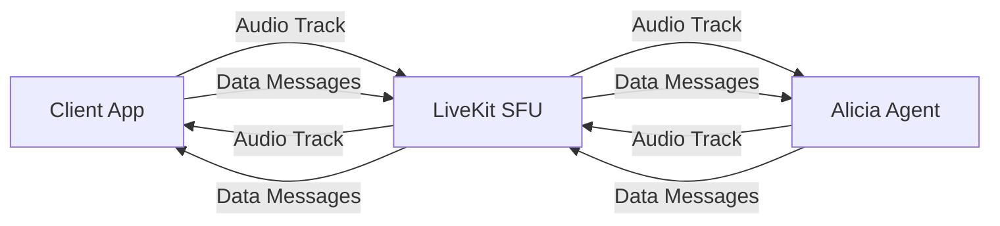
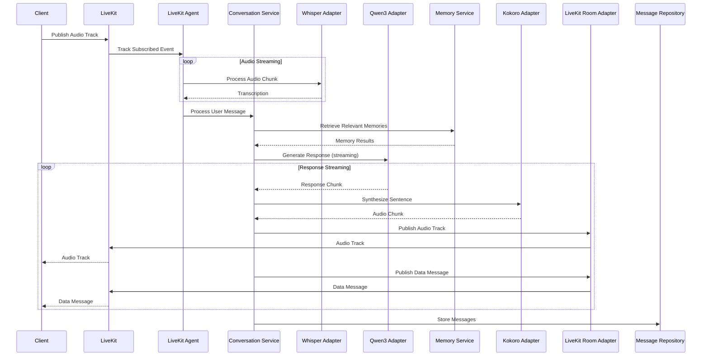
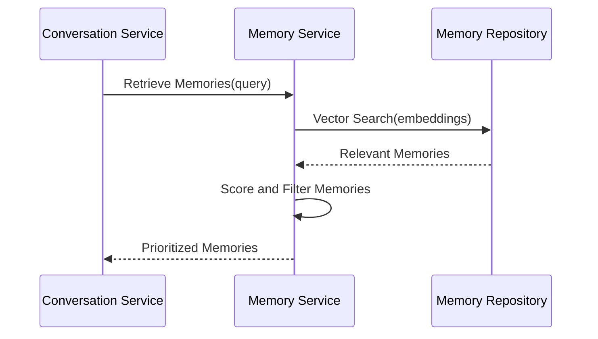
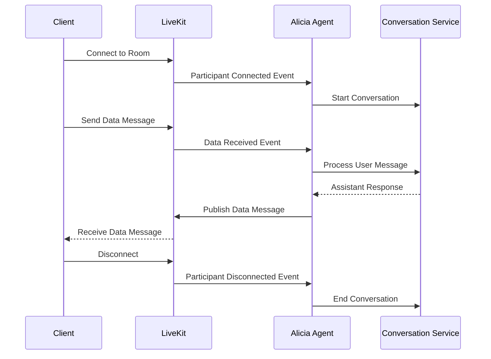

# Alicia Components Architecture

This document outlines the components that implement Alicia following a hexagonal architecture approach. The architecture is simple yet flexible, with clear separation of concerns.

> **Implementation Status**: This document describes both implemented and planned components. Look for status markers:
> - ✅ **Implemented**: Component is fully built and functional
> - ⚠️ **Partial**: Component exists but has missing functionality
> - 🚧 **Planned**: Component is designed but not yet implemented

## Hexagonal Architecture Overview

Hexagonal Architecture (also known as Ports and Adapters) organizes the application into layers:

1. **Domain Layer** - Contains the core business logic and domain models
2. **Application Layer** - Contains use cases and orchestrates the domain
3. **Adapters Layer** - Connects the application to external systems (LiveKit, databases, external services)

The key principle is that dependencies point inward, with the domain at the center having no dependencies on outer layers.

```mermaid
graph TD
    subgraph "Adapters Layer"
        LK[LiveKit Agent]
        REST[REST API]
        DB[Database Adapters]
        ASR[ASR Adapters]
        LLM[LLM Adapters]
        TTS[TTS Adapters]
        LKRoom[LiveKit Room]
    end

    subgraph "Application Layer"
        UC[Use Cases]
    end

    subgraph "Domain Layer"
        DM[Domain Models]
        SV[Domain Services]
        PO[Ports]
    end

    LK --> UC
    REST --> UC
    DB --> UC
    ASR --> UC
    LLM --> UC
    TTS --> UC
    LKRoom --> UC

    UC --> DM
    UC --> SV
    UC --> PO

    SV --> DM
    PO --> DM
</graph>
```

## Core Components

### Domain Layer

The Domain Layer contains the core business logic and entities of the application, independent of any external systems or frameworks.

#### Domain Models

1. **Conversation** ✅
   - Represents a conversation between a user and the assistant
   - Contains conversation metadata and references to messages
   - Key attributes:
     - `id`: Unique identifier (NanoID)
     - `title`: Descriptive title for the conversation
     - `created_at`: When the conversation was created
     - `updated_at`: When the conversation was last updated
     - `status`: Whether the conversation is active, archived, or other
     - `preferences`: User preferences for this conversation (TTS settings, language, etc.)
   - Maintains the overall conversation state and context
   - Critical for implementing the "Persistent Conversation Memory" user story

2. **Message** ✅
   - Base model for all message types
   - Contains common fields like ID, conversation ID, timestamp
   - Key attributes:
     - `id`: Unique identifier (NanoID)
     - `conversation_id`: Reference to the conversation
     - `previous_id`: Reference to the previous message
     - `sequence_number`: Order of the message within the conversation
     - `created_at`: When the message was created
   - Provides the foundation for the conversation history
   - Enables the linked-list structure for message ordering

3. **UserMessage** ✅
   - Extends Message
   - Contains user's input text
   - Key attributes:
     - `contents`: The text content of the user's message
     - `audio_id`: Optional reference to associated audio
   - Represents the user's side of the conversation
   - May be created from text input or transcribed audio

4. **AssistantMessage** ✅
   - Extends Message
   - Contains assistant's response text
   - Key attributes:
     - `contents`: The text content of the assistant's response
     - `audio_id`: Optional reference to associated audio
     - `reasoning_text`: Optional references to reasoning steps
     - `tool_uses`: Optional references to tool uses
   - Represents the assistant's side of the conversation
   - May include references to reasoning, tool usage, and memory retrieval

5. **Audio** ✅
   - Represents audio data for speech input/output
   - Contains audio format, duration, and binary data
   - Key attributes:
     - `id`: Unique identifier
     - `audio_type`: Type of audio ('input' or 'output')
     - `audio_format`: Format of the audio data ('wav', 'pcm', etc.)
     - `audio_data`: The actual audio data
     - `duration_ms`: Duration of the audio in milliseconds
     - `transcription`: Optional transcription of the audio content
   - Critical for implementing the voice conversation features

6. **Memory** ✅
   - Represents a piece of information stored in long-term memory
   - Contains content, embeddings, importance score, etc.
   - Key attributes:
     - `id`: Unique identifier
     - `content`: The memory content
     - `embeddings`: Vector embeddings for semantic search
     - `sha256`: Hash of the content
     - `importance`: Importance score for prioritizing memories
     - `confidence`: Confidence score in the memory's accuracy
     - `source_type`: Type of source ('conversation', 'document', etc.)
     - `source_info`: Identification of the source (conversation id, document name, etc)
     - `tags`: Array of tags for categorization
     - `created_at`: When the memory was created
   - Enables the assistant to remember previous conversations
   - Supports semantic search for relevant information
   - Critical for implementing the "Persistent Conversation Memory" user story

7. **Tool** ✅
   - Represents an external tool that can be used by the assistant
   - Contains tool name, parameters, and result schema
   - Key attributes:
     - `name`: The name of the tool
     - `description`: Description of what the tool does
     - `parameters_schema`: Schema defining the tool's parameters
     - `result_schema`: Schema defining the tool's result format
   - Enables the assistant to perform actions beyond conversation
   - Supports integration with external systems and APIs
   - Critical for implementing the "Tool Integration" user story

8. **MessageSentence** ✅
   - Represents a single sentence from an assistant message
   - Key attributes:
     - `id`: Unique identifier
     - `message_id`: Reference to the parent message
     - `sequence_number`: Order of the sentence within the message
     - `text`: The sentence text content
     - `is_final`: Whether the sentence has been finalized or not (useful to decide to play audio or not)
     - `audio_data`: Optional audio data for this sentence
     - `audio_type`: Type of audio ('input' or 'output')
     - `audio_format`: Format of the audio data ('wav', 'pcm', etc.)
     - `audio_duration_ms`: Duration of the audio in milliseconds
   - Enables sentence-by-sentence streaming of assistant responses
   - Supports synchronized text and audio playback
   - Critical for implementing the "Streaming Audio Response" user story

#### Domain Services

1. **ConversationService** ✅
   - Core service for managing conversations
   - Handles conversation state and context
   - Key responsibilities:
     - Creating and retrieving conversations
     - Adding messages to conversations
     - Maintaining conversation context
     - Managing conversation preferences
     - Coordinating between other services
   - Central orchestrator for the conversation flow
   - Ensures conversation integrity and consistency
   - Implements the real-time conversation logic

2. **TranscriptionService** ✅
   - Manages audio transcription from user speech
   - Handles real-time speech-to-text conversion
   - Key responsibilities:
     - Processing audio chunks from LiveKit audio tracks
     - Converting audio to text using ASR service
     - Handling partial and final transcriptions
     - Managing transcription state and context
   - Critical for voice input capabilities
   - Enables real-time user speech processing

3. **ResponseService** ✅
   - Manages the assistant's response generation
   - Handles LLM interaction and response streaming
   - Key responsibilities:
     - Coordinating with LLM service for generation
     - Managing streaming response delivery
     - Handling tool use during generation
     - Processing and formatting responses
   - Core service for AI response generation
   - Implements streaming response capabilities

4. **MemoryService** ✅
   - Manages retrieval and storage of memories
   - **Status**: Fully implemented and integrated into conversation flow
   - **Implementation**: Memory retrieval is integrated in `generate_response.go:106-122`
   - Handles memory importance scoring and relevance
   - Key responsibilities:
     - Storing new memories from conversations
     - Retrieving relevant memories based on context
     - Computing vector embeddings for semantic search
     - Scoring and ranking memories by relevance
     - Managing memory lifecycle (creation, update, deletion)
   - Critical for providing context-aware responses
   - Enables the assistant to recall previous information
   - Implements the "Persistent Conversation Memory" user story

5. **ToolService** ✅
   - Manages external tool execution
   - Handles tool discovery and invocation
   - Key responsibilities:
     - Registering and discovering available tools
     - Validating tool parameters
     - Executing tools and handling results
     - Managing tool errors and retries
   - Extends the assistant's capabilities beyond conversation
   - Enables integration with external systems
   - Supports the "Tool Integration" user story

6. **AudioService** ✅
   - Handles audio processing workflows
   - Manages audio streaming and synchronization
   - Key responsibilities:
     - Managing audio processing workflows
     - Coordinating between ASR and TTS services
     - Handling audio format conversions
     - Segmenting text into sentences for TTS
     - Synchronizing text and audio streams
     - Publishing audio to LiveKit tracks
   - Enables the voice conversation capabilities
   - Supports multilingual translation features
   - Implements the "Real-time Voice Conversation" user story

#### Ports (Interfaces)

The ports define the interfaces through which the domain interacts with external systems, following the dependency inversion principle.

##### Input Ports

1. **LiveKitEventPort** ✅
   - Interface for receiving LiveKit room events
   - Key events:
     - `ParticipantConnected(participant Participant)`
     - `ParticipantDisconnected(participant Participant)`
     - `DataReceived(data []byte, participant Participant)`
     - `TrackSubscribed(track Track, participant Participant)`
     - `TrackUnsubscribed(track Track, participant Participant)`
   - Enables real-time communication through LiveKit
   - Abstracts LiveKit's event system
   - Primary input mechanism for user interactions

2. **TokenRequestPort** ✅
   - Interface for handling access token requests
   - Key operations:
     - `GenerateToken(identity string, roomName string, metadata TokenMetadata) (Token, error)`
     - `ValidateToken(token string) (TokenClaims, error)`
   - Enables secure access to LiveKit rooms
   - Manages participant authentication
   - Implements access control for conversations

##### Output Ports

1. **MessageRepository** ✅
   - Interface for storing and retrieving messages
   - Key methods:
     - `SaveMessage(message Message) error`
     - `GetMessageById(id string) (Message, error)`
     - `GetMessagesByConversationId(conversationId string) ([]Message, error)`
     - `UpdateMessage(message Message) error`
   - Enables persistence of conversation messages
   - Abstracts the database implementation details
   - Allows for different storage backends

2. **ConversationRepository** ✅
   - Interface for storing and retrieving conversations
   - Key methods:
     - `SaveConversation(conversation Conversation) error`
     - `GetConversationById(id string) (Conversation, error)`
     - `ListConversations(userId string) ([]Conversation, error)`
     - `UpdateConversation(conversation Conversation) error`
   - Manages the persistence of conversation metadata
   - Supports conversation history management
   - Enables multi-platform synchronization

3. **AudioRepository** ✅
   - Interface for storing and retrieving audio data
   - Key methods:
     - `SaveAudio(audio Audio) error`
     - `GetAudioById(id string) (Audio, error)`
     - `DeleteAudio(id string) error`
   - Handles the storage of potentially large audio files
   - Supports efficient retrieval for playback
   - Enables offline mode with audio caching

4. **MemoryRepository** ✅
   - Interface for storing and retrieving memories
   - Includes vector search capabilities
   - Key methods:
     - `SaveMemory(memory Memory) error`
     - `GetMemoryById(id string) (Memory, error)`
     - `SearchMemories(embedding []float32, limit int) ([]Memory, error)`
     - `DeleteMemory(id string) error`
   - Enables semantic search using vector embeddings
   - Critical for the retrieval-augmented generation
   - Abstracts the vector database implementation

5. **ASRPort** ✅
   - Interface for speech recognition services
   - Key methods:
     - `TranscribeAudio(audioData []byte, format string) (string, error)`
     - `StreamingTranscribe(audioStream <-chan []byte) (<-chan string, error)`
   - Abstracts the speech recognition implementation
   - Supports both batch and streaming transcription
   - Enables real-time voice input processing

6. **LLMPort** ✅
   - Interface for language model services
   - Key methods:
     - `GenerateResponse(prompt string, options GenerationOptions) (string, error)`
     - `StreamingGenerate(prompt string, options GenerationOptions) (<-chan string, error)`
     - `EmbedText(text string) ([]float32, error)`
   - Core interface for AI language capabilities
   - Abstracts the specific LLM implementation
   - Supports both complete and streaming generation

7. **TTSPort** ✅
   - Interface for text-to-speech services
   - Key methods:
     - `SynthesizeSpeech(text string, voice string) ([]byte, error)`
     - `StreamingSynthesize(textStream <-chan string, voice string) (<-chan []byte, error)`
   - Enables voice output capabilities
   - Supports different voices and languages
   - Abstracts the TTS implementation details

8. **ToolPort** ✅
   - Interface for external tool integration
   - Key methods:
     - `ExecuteTool(name string, parameters map[string]interface{}) (interface{}, error)`
     - `ListAvailableTools() []Tool`
     - `GetToolSchema(name string) ToolSchema`
   - Enables the assistant to use external tools
   - Provides a unified interface for diverse tools
   - Supports dynamic tool discovery and execution

9. **LiveKitRoomPort** ✅
   - Interface for LiveKit room operations
   - Key methods:
     - `PublishData(data []byte, reliable bool, destinationIdentities []string) error`
     - `PublishAudioTrack(audioStream <-chan []byte, trackName string) error`
     - `UnpublishTrack(trackName string) error`
     - `GetParticipants() []Participant`
     - `DisconnectParticipant(identity string) error`
   - Enables sending data and audio to participants
   - Abstracts LiveKit's room API
   - Critical for real-time communication output

### Application Layer

The Application Layer contains the use cases that orchestrate the flow of data and business rules, coordinating between the domain layer and the adapters.

#### Use Cases

1. **StartConversationUseCase** ✅
   - Initializes a new conversation
   - Key operations:
     - Creating a new conversation record
     - Setting initial preferences
     - Generating a welcome message if needed
     - Returning the conversation ID to the client
   - Entry point for new conversations
   - Handles conversation initialization logic
   - Sets up the foundation for the conversation flow

2. **ProcessUserMessageUseCase** ✅
   - Handles incoming user messages
   - Orchestrates the flow from user input to assistant response
   - Key operations:
     - Validating the user message
     - Storing the message in the repository
     - Coordinating with other use cases for processing
     - Managing the conversation state transitions
   - Central coordinator for the conversation flow
   - Handles both text and audio input paths
   - Ensures proper sequencing of operations

3. **GenerateAssistantResponseUseCase** ✅
   - Generates the assistant's response to a user message
   - Coordinates between LLM, memory, and tools
   - Key operations:
     - Retrieving relevant memories
     - Preparing the LLM prompt with context
     - Managing the generation process
     - Handling tool use during generation
     - Processing and storing the generated response
   - Core use case for the assistant's intelligence
   - Implements the streaming response capability
   - Coordinates complex interactions between services

4. **TranscribeAudioUseCase** ✅
   - Converts audio input to text using ASR
   - Key operations:
     - Processing audio chunks from LiveKit tracks
     - Managing the ASR service interaction
     - Handling partial and final transcriptions
     - Converting transcriptions to user messages
   - Enables voice input capability
   - Supports real-time transcription feedback
   - Handles different audio formats and qualities

5. **SynthesizeSpeechUseCase** ✅
   - Converts text to speech using TTS
   - Key operations:
     - Breaking text into sentences
     - Managing the TTS service interaction
     - Handling audio format conversions
     - Streaming audio chunks to LiveKit
   - Enables voice output capability
   - Supports different voices and languages
   - Implements the streaming audio response feature

6. **RetrieveMemoryUseCase** ✅
   - Retrieves relevant memories for the current context
   - **Status**: Fully implemented and integrated into conversation flow
   - **Implementation**: Called from `GenerateAssistantResponseUseCase` in `generate_response.go:106-122`
   - Key operations:
     - Creating embeddings for the query
     - Searching the vector database
     - Scoring and ranking results
     - Formatting memories for inclusion in context
   - Critical for context-aware responses
   - Implements the semantic search functionality
   - Supports the "Persistent Conversation Memory" user story

7. **StoreMemoryUseCase** ✅
   - Stores new memories from the conversation
   - **Status**: Fully implemented and integrated into conversation flow
   - Key operations:
     - Extracting important information
     - Creating embeddings for the memory
     - Assigning importance scores
     - Storing in the memory repository
   - Builds the assistant's long-term memory
   - Enables future recall of conversation details
   - Implements the memory persistence logic

8. **ExecuteToolUseCase** ✅
   - Executes external tools as needed by the assistant
   - Key operations:
     - Validating tool parameters
     - Routing to the appropriate tool implementation
     - Handling tool execution errors
     - Formatting results for the assistant
   - Extends the assistant's capabilities beyond conversation
   - Enables integration with external systems
   - Supports the "Tool Integration" user story

9. **ManageConversationHistoryUseCase** ✅
   - Manages the user's conversation history
   - Key operations:
     - Listing conversations
     - Searching conversation history
     - Exporting conversations
     - Archiving or deleting conversations
   - Supports the "Conversation History Management" user story
   - Enables organization of past interactions
   - Provides user control over conversation data

### Adapters Layer

The Adapters Layer connects the application to external systems, implementing the interfaces defined by the ports.

#### Input Adapters

1. **LiveKitAgent** ✅
   - Main entry point for the Alicia assistant
   - Implements LiveKit's Agent framework
   - Key responsibilities:
     - Connecting to LiveKit rooms
     - Handling participant lifecycle events
     - Processing incoming data messages
     - Subscribing to participant audio tracks
     - Routing events to appropriate use cases
     - Managing the agent's state within the room
   - Critical for real-time communication capabilities
   - Implements the LiveKit protocol integration
   - Handles the complexities of bidirectional streaming

   ```go
   type AliciaAgent struct {
       conversationService *ConversationService
       audioService        *AudioService
   }

   func (a *AliciaAgent) OnParticipantConnected(participant *livekit.Participant) {
       // Handle new participant joining the room
       a.conversationService.StartConversation(participant.Identity)
   }

   func (a *AliciaAgent) OnDataReceived(data []byte, participant *livekit.Participant) {
       // Handle incoming data messages from participants
       message := decodeMessage(data)
       a.conversationService.ProcessUserMessage(participant.Identity, message)
   }

   func (a *AliciaAgent) OnTrackSubscribed(track *livekit.Track, participant *livekit.Participant) {
       // Handle audio track subscription
       if track.Kind == livekit.TrackKindAudio {
           a.audioService.ProcessAudioStream(track.Stream(), participant.Identity)
       }
   }
   ```

2. **RESTAPIAdapter** ✅
   - Handles HTTP requests for non-streaming operations
   - Provides REST API endpoints
   - Key responsibilities:
     - Exposing token generation endpoint
     - Handling conversation management endpoints
     - Providing conversation history access
     - Implementing authentication and authorization
     - Serving API documentation
   - Complements LiveKit for non-streaming operations
   - Enables integration with standard HTTP clients
   - Provides access control for LiveKit rooms

   ```go
   // Token generation endpoint
   func (h *Handler) GenerateToken(w http.ResponseWriter, r *http.Request) {
       var req TokenRequest
       json.NewDecoder(r.Body).Decode(&req)

       // Generate LiveKit access token for a participant
       token, _ := h.tokenService.GenerateToken(
           req.UserID,
           req.ConversationID,
           req.Metadata,
       )
       json.NewEncoder(w).Encode(map[string]string{"token": token})
   }

   // Conversation management endpoints
   func (h *Handler) ListConversations(w http.ResponseWriter, r *http.Request) {
       userID := r.URL.Query().Get("user_id")
       conversations, _ := h.conversationService.ListConversations(userID)
       json.NewEncoder(w).Encode(conversations)
   }
   ```

#### Output Adapters

##### Database Adapters

1. **PostgresMessageRepository** ✅
   - Implements MessageRepository using PostgreSQL
   - Uses type-safe database access
   - Key responsibilities:
     - Implementing CRUD operations for messages
     - Mapping between domain models and database schema
     - Handling database transactions
     - Optimizing queries for performance
   - Ensures type-safe database access
   - Provides efficient storage and retrieval of messages
   - Implements the database schema

2. **PostgresConversationRepository** ✅
   - Implements ConversationRepository using PostgreSQL
   - Key responsibilities:
     - Managing conversation records
     - Handling conversation metadata
     - Supporting conversation listing and filtering
     - Implementing conversation search
   - Stores conversation metadata and preferences
   - Supports efficient conversation retrieval
   - Enables conversation history management

3. **PostgresAudioRepository** ✅
   - Implements AudioRepository using PostgreSQL
   - Key responsibilities:
     - Storing and retrieving audio data
     - Managing audio metadata
     - Handling large binary data efficiently
     - Implementing audio caching strategies
   - Efficiently stores potentially large audio files
   - Supports audio playback and transcription
   - Manages audio lifecycle (creation, access, deletion)

4. **PgVectorMemoryRepository** ✅
   - Implements MemoryRepository using pgvector
   - Provides vector search capabilities
   - Key responsibilities:
     - Storing vector embeddings
     - Implementing similarity search
     - Managing memory metadata
     - Optimizing vector operations
   - Enables semantic search using vector embeddings
   - Critical for retrieval-augmented generation
   - Leverages pgvector for efficient vector operations

##### External Service Adapters

1. **SpeachesASRAdapter** ✅
   - Implements ASRPort using speaches server (OpenAI-compatible API)
   - Handles streaming audio transcription
   - Key responsibilities:
     - Connecting to speaches server
     - Processing audio chunks via HTTP API
     - Handling streaming transcription
     - Supporting multiple languages
     - Optimizing for real-time performance
   - Enables real-time speech recognition
   - Supports multilingual transcription
   - Optimized for low-latency operation

   ```go
   type SpeachesASRAdapter struct {
       client *openai.Client
       model  string
   }

   func (s *SpeachesASRAdapter) StreamingTranscribe(ctx context.Context, audioStream <-chan []byte) (<-chan string, error) {
       results := make(chan string)

       go func() {
           defer close(results)
           for audioChunk := range audioStream {
               resp, _ := s.client.CreateTranscription(ctx, openai.TranscriptionRequest{
                   Audio: bytes.NewReader(audioChunk),
                   Model: s.model,
               })
               results <- resp.Text
           }
       }()

       return results, nil
   }
   ```

2. **LiteLLMAdapter** ✅
   - Implements LLMPort using LiteLLM (OpenAI-compatible API)
   - Handles language understanding and generation via vLLM backend
   - Key responsibilities:
     - Connecting to LiteLLM proxy server
     - Implementing prompt engineering
     - Handling streaming generation
     - Managing context windows
     - Routing to appropriate backend models
   - Core adapter for AI language capabilities
   - Supports streaming token generation
   - Optimized for consumer hardware

   ```go
   type LiteLLMAdapter struct {
       client *openai.Client
       model  string
   }

   func (l *LiteLLMAdapter) StreamingGenerate(ctx context.Context, prompt string, options GenerationOptions) (<-chan string, error) {
       results := make(chan string)

       go func() {
           defer close(results)
           stream, _ := l.client.CreateChatCompletionStream(ctx, openai.ChatCompletionRequest{
               Model:       l.model,
               Messages:    []openai.ChatCompletionMessage{{Role: "user", Content: prompt}},
               Temperature: options.Temperature,
               MaxTokens:   options.MaxTokens,
               Stream:      true,
           })

           for chunk := range stream {
               results <- chunk.Choices[0].Delta.Content
           }
       }()

       return results, nil
   }
   ```

3. **SpeachesTTSAdapter** ✅
   - Implements TTSPort using speaches server (OpenAI-compatible API)
   - Handles text-to-speech synthesis via Kokoro
   - Key responsibilities:
     - Connecting to speaches server
     - Processing text into speech via HTTP API
     - Supporting different voices
     - Handling streaming synthesis
     - Optimizing audio quality
   - Enables natural-sounding voice output
   - Supports multiple languages and voices
   - Optimized for sentence-by-sentence streaming

   ```go
   type SpeachesTTSAdapter struct {
       client *openai.Client
       voice  string
   }

   func (t *SpeachesTTSAdapter) StreamingSynthesize(ctx context.Context, textStream <-chan string, voice string) (<-chan []byte, error) {
       audioChunks := make(chan []byte)

       go func() {
           defer close(audioChunks)
           for sentence := range textStream {
               resp, _ := t.client.CreateSpeech(ctx, openai.CreateSpeechRequest{
                   Model: "kokoro",
                   Voice: voice,
                   Input: sentence,
               })
               audioChunks <- resp.Audio
           }
       }()

       return audioChunks, nil
   }
   ```

4. **LiveKitRoomAdapter** ✅
   - Implements LiveKitRoomPort
   - Handles LiveKit room operations
   - Key responsibilities:
     - Publishing data messages to participants
     - Publishing audio tracks to the room
     - Managing track lifecycle
     - Handling participant queries
     - Implementing room control operations
   - Enables outbound real-time communication
   - Abstracts LiveKit's room API
   - Critical for streaming responses to users

   ```go
   type LiveKitRoomAdapter struct {
       room *livekit.Room
   }

   func (l *LiveKitRoomAdapter) PublishData(data []byte, reliable bool, destinationIdentities []string) error {
       // Publish data message to participants
       return l.room.LocalParticipant.PublishData(data, livekit.DataPacketKind_RELIABLE, destinationIdentities...)
   }

   func (l *LiveKitRoomAdapter) PublishAudioTrack(ctx context.Context, audioStream <-chan []byte, trackName string) error {
       // Publish audio stream as a track
       source := livekit.NewAudioSource(24000, 1)
       track := livekit.NewLocalAudioTrack(trackName, source)

       l.room.LocalParticipant.PublishTrack(track, nil)

       go func() {
           for audioChunk := range audioStream {
               source.CaptureFrame(audioChunk)
           }
       }()

       return nil
   }
   ```

5. **ToolRegistry** ✅
   - Manages available tools
   - **Status**: Framework fully implemented with working tools
   - **Implementation**: Web search tool fully functional with DuckDuckGo integration (see `docs/WEB_SEARCH_IMPLEMENTATION.md`)
   - Routes tool requests to appropriate implementations
   - Key responsibilities:
     - Registering available tools
     - Validating tool parameters
     - Routing tool requests
     - Managing tool execution
     - Handling tool errors
   - Enables extensibility through tools
   - Supports dynamic tool discovery
   - Implements the tool execution framework

## LiveKit Integration Architecture

### Communication Flow

LiveKit serves as the real-time communication layer for Alicia, replacing traditional HTTP/WebSocket approaches with a more robust, production-ready solution.



### Agent Initialization

The Alicia agent starts by connecting to a LiveKit room and waiting for participants:

```go
func main() {
    // Initialize services
    conversationService := NewConversationService(...)
    audioService := NewAudioService(...)

    // Create agent
    agent := NewAliciaAgent(conversationService, audioService)

    // Connect to LiveKit
    room := livekit.NewRoom()

    // Register event handlers
    room.OnParticipantConnected(agent.OnParticipantConnected)
    room.OnDataReceived(agent.OnDataReceived)
    room.OnTrackSubscribed(agent.OnTrackSubscribed)

    // Connect to room
    room.Connect(url, token)
}
```

### Data Message Protocol

Alicia sends and receives structured data messages through LiveKit's data channel:

```go
// Sending a message
message := map[string]interface{}{
    "type":           "assistant_message",
    "conversationId": "abc123",
    "messageId":      "msg456",
    "content":        "Hello, how can I help you?",
}
data, _ := json.Marshal(message)
roomAdapter.PublishData(data, true, nil)

// Receiving a message
func onDataReceived(data []byte, participant *livekit.Participant) {
    var message map[string]interface{}
    json.Unmarshal(data, &message)
    if message["type"] == "user_message" {
        processUserMessage(message)
    }
}
```

### Audio Streaming

Audio flows through LiveKit's audio tracks, enabling high-quality voice conversations:

```go
// Subscribe to user's audio
func onTrackSubscribed(track *livekit.Track, participant *livekit.Participant) {
    if track.Kind == livekit.TrackKindAudio {
        audioStream := livekit.NewAudioStream(track)
        for frame := range audioStream.Frames() {
            // Send to speaches for transcription
            transcriptionService.ProcessAudio(frame.Data)
        }
    }
}

// Publish assistant's audio
func publishAssistantAudio(audioStream <-chan []byte) {
    source := livekit.NewAudioSource(24000, 1)
    track := livekit.NewLocalAudioTrack("assistant_voice", source)
    room.LocalParticipant.PublishTrack(track, nil)

    go func() {
        for audioChunk := range audioStream {
            frame := livekit.NewAudioFrame(audioChunk, 24000, 1)
            source.CaptureFrame(frame)
        }
    }()
}
```

## Package Structure

The implementation follows this package structure:

```
alicia/
├── cmd/alicia/             # CLI entry point (unified)
│   ├── main.go             # Entry point with Cobra commands
│   ├── agent.go            # LiveKit agent command
│   ├── serve.go            # HTTP server command
│   ├── chat.go             # Interactive chat command
│   ├── conversation.go     # Conversation management commands
│   └── common.go           # Shared utilities
├── internal/               # Private application code
│   ├── adapters/           # Adapter implementations
│   │   ├── http/           # HTTP API server
│   │   │   ├── server.go
│   │   │   ├── handlers/   # Endpoint handlers
│   │   │   ├── dto/        # Data transfer objects
│   │   │   └── middleware/ # HTTP middleware
│   │   ├── postgres/       # Database adapters
│   │   │   ├── conversation_repository.go
│   │   │   ├── message_repository.go
│   │   │   ├── memory_repository.go
│   │   │   ├── audio_repository.go
│   │   │   └── sqlc/       # Generated sqlc code
│   │   ├── livekit/        # LiveKit integration
│   │   │   └── audio_converter.go  # Opus codec handling
│   │   ├── speech/         # ASR/TTS adapters
│   │   ├── embedding/      # Embedding service adapter
│   │   ├── mcp/            # Model Context Protocol
│   │   ├── id/             # ID generation (NanoID)
│   │   └── metrics/        # Prometheus metrics
│   ├── application/        # Application layer
│   │   ├── services/       # Application services
│   │   │   ├── conversation.go
│   │   │   ├── message.go
│   │   │   ├── memory.go
│   │   │   ├── tool.go
│   │   │   └── audio.go
│   │   ├── usecases/       # Use case implementations
│   │   │   ├── generate_response.go
│   │   │   ├── manage_conversation.go
│   │   │   └── handle_tool.go
│   │   ├── chat/           # Chat session logic
│   │   │   └── session.go
│   │   └── tools/          # Tool system
│   │       ├── coordinator.go
│   │       └── builtin/    # Built-in tools
│   ├── domain/             # Domain layer
│   │   ├── models/         # Domain models
│   │   │   ├── conversation.go
│   │   │   ├── message.go
│   │   │   ├── audio.go
│   │   │   ├── memory.go
│   │   │   ├── tool.go
│   │   │   ├── reasoning.go
│   │   │   └── sentence.go
│   │   └── errors.go       # Domain-specific errors
│   ├── ports/              # Interface definitions
│   │   ├── services.go
│   │   └── repositories.go
│   ├── llm/                # LLM client
│   │   ├── client.go
│   │   └── service.go
│   └── config/             # Configuration management
│       └── config.go
├── pkg/                    # Public library code
│   └── protocol/           # Protocol definitions
│       ├── types.go        # Message type constants
│       ├── envelope.go     # Envelope structure
│       └── messages.go     # Message structures
├── migrations/             # Database migrations
│   └── 001_init.up.sql
├── frontend/               # React web application
│   └── src/
│       ├── components/     # UI components
│       ├── hooks/          # React hooks
│       ├── services/       # API integration
│       └── types/          # TypeScript types
├── android/                # Native Android app
│   ├── app/                # Main application module
│   ├── core/               # Shared modules
│   ├── feature/            # Feature modules
│   └── service/            # Background services
├── docs/                   # Documentation (mdbook)
└── flake.nix               # Nix flake for reproducible builds
```

## Component Interactions

### Conversation Flow

The following diagram illustrates the flow of a typical conversation with LiveKit:



### Memory Retrieval Flow



### LiveKit Event Flow



## Key Design Decisions

### Why LiveKit?

LiveKit provides several advantages over custom WebSocket implementations:

1. **Production-Ready Infrastructure**: Built-in scalability, reliability, and monitoring
2. **Multi-Platform Support**: SDKs for web, mobile, and desktop platforms
3. **Audio/Video Processing**: Native support for high-quality audio streaming
4. **Selective Forwarding Unit (SFU)**: Efficient media routing for multi-party conversations
5. **Data Channels**: Reliable and unreliable data messaging
6. **Built-in Security**: Token-based authentication and encryption
7. **Developer Tools**: Dashboard, CLI, and debugging utilities

### Hexagonal Architecture Benefits

1. **Testability**: Core logic can be tested independently of LiveKit
2. **Flexibility**: Easy to swap LiveKit for another real-time platform
3. **Maintainability**: Clear separation of concerns makes code easier to understand
4. **Extensibility**: New features can be added without modifying existing code
5. **Technology Independence**: Domain logic is independent of frameworks and libraries

### Service Communication

Services communicate through well-defined interfaces (ports), enabling:

1. **Loose Coupling**: Services can be modified independently
2. **Clear Dependencies**: Explicit interfaces make dependencies visible
3. **Easy Mocking**: Interfaces can be mocked for testing
4. **Language Flexibility**: Services can be implemented in different languages
5. **Deployment Flexibility**: Services can be deployed separately if needed
