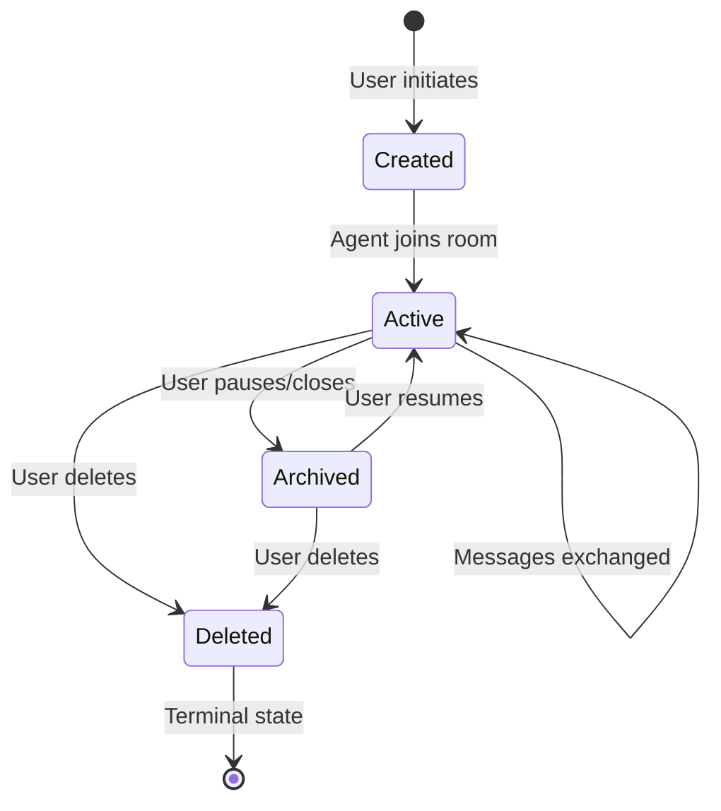
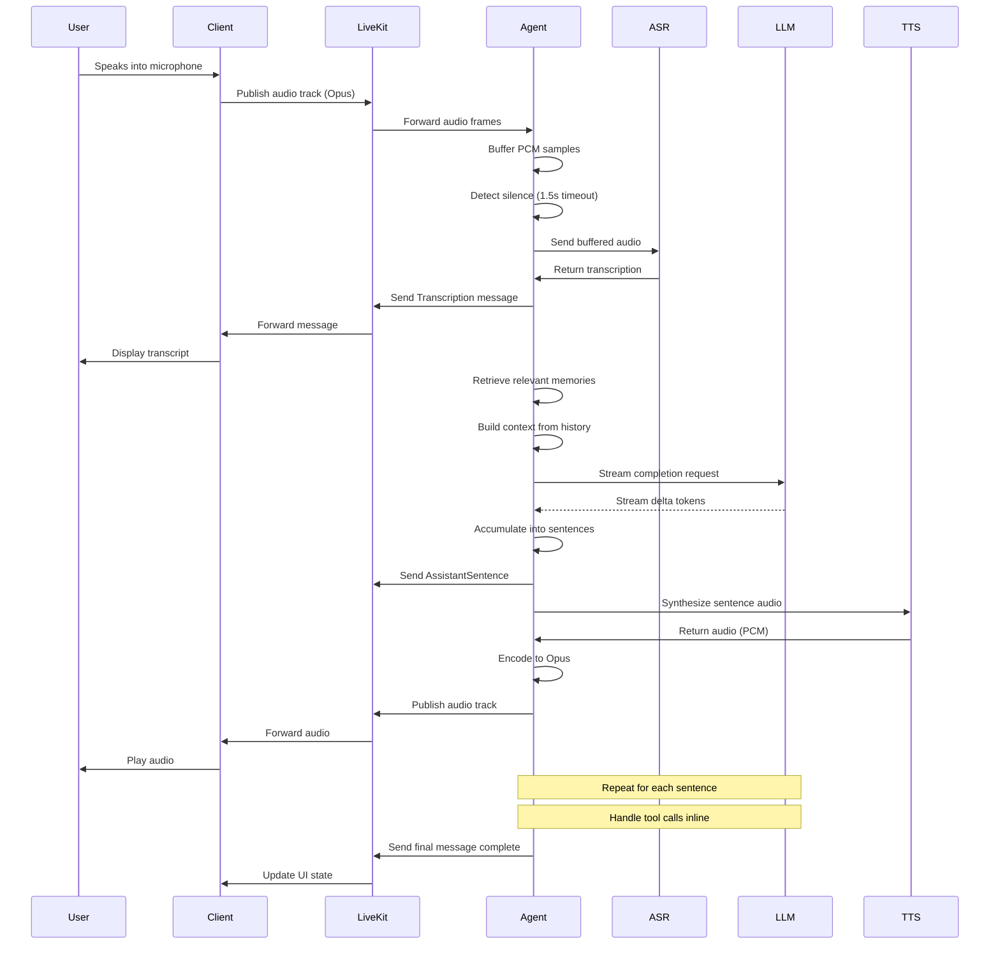
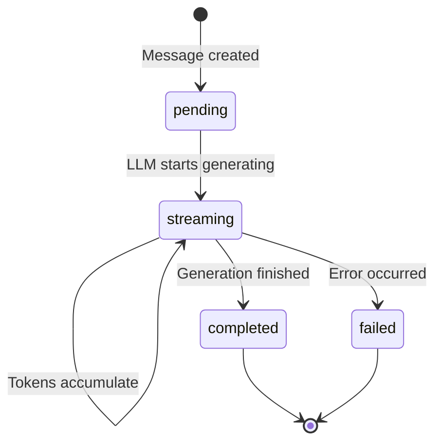

# Conversation Workflow

**Last updated:** 2026-01-02 (synchronized with codebase implementation)

This document describes the end-to-end flow of a conversation in Alicia, from initiation through message exchange to session termination. It covers the complete lifecycle including state transitions, message processing, and error handling.

## Overview

A conversation in Alicia represents a continuous interaction session between a user and the AI agent. Each conversation:

- Maps to exactly one LiveKit room (`conv_{conversationID}`)
- Maintains an ordered sequence of messages
- Tracks state transitions (active ↔ archived ↔ deleted)
- Supports interruption and regeneration
- Handles graceful reconnection after network failures

## Conversation Lifecycle



### States

**Active**: Conversation is live, agent is connected, messages flowing
- LiveKit room exists and is joinable
- Agent process is connected to room
- User can send/receive messages

**Archived**: Conversation is paused but can be resumed
- LiveKit room may be destroyed (recreated on resume)
- Agent has disconnected
- Message history preserved in database
- Resumable by user

**Deleted**: Conversation is permanently removed (soft delete)
- LiveKit room destroyed
- `deleted_at` timestamp set
- Hidden from user's conversation list
- Data retained for audit/recovery (not physically deleted)

## Conversation Initiation

### Step 1: User Creates Conversation

**Web client** (`POST /api/conversations`):
```typescript
const response = await api.createConversation({
  title: "New conversation",
  preferences: {
    enableMemory: true,
    enableReasoning: false,
    ttsVoice: "af_sky"
  }
});

const { id, livekitRoomName, token } = response;
```

**Backend handler** (`internal/application/usecases/manage_conversation.go`):
```go
func (uc *ManageConversation) Create(ctx context.Context, userID, title string) (*models.Conversation, error) {
    // Generate conversation ID
    conversationID := uc.idGenerator.GenerateID()

    // Create conversation model
    conv := models.NewConversation(conversationID, userID, title)

    // Create LiveKit room
    roomName := fmt.Sprintf("conv_%s", conversationID)
    room, err := uc.livekitService.CreateRoom(ctx, roomName)
    if err != nil {
        return nil, fmt.Errorf("failed to create room: %w", err)
    }

    conv.LiveKitRoomName = roomName

    // Persist to database
    err = uc.conversationRepo.Create(ctx, conv)
    if err != nil {
        return nil, fmt.Errorf("failed to create conversation: %w", err)
    }

    return conv, nil
}
```

### Step 2: LiveKit Room Created

Room configuration:
```go
req := &livekit.CreateRoomRequest{
    Name:            "conv_abcd1234",
    EmptyTimeout:    300,              // 5 minutes after last participant
    MaxParticipants: 2,                // User + agent
    Metadata:        `{"conversation_id": "abcd1234", "created_at": "..."}`,
}
```

### Step 3: Client Connects to Room

**Get token**:
```typescript
const token = await api.getLiveKitToken(conversationId);
```

**Connect**:
```typescript
const room = new Room();
await room.connect(livekitUrl, token);

// Publish microphone
const audioTrack = await createLocalAudioTrack();
await room.localParticipant.publishTrack(audioTrack);
```

### Step 4: Agent Joins Room

The agent process receives notification (via job queue or polling) and connects:

```go
agent := livekit.NewAgent(config, callbacks)
err = agent.ConnectToRoom(ctx, "conv_abcd1234", agentToken)
```

**Agent setup**:
1. Subscribes to user's audio track
2. Publishes its own audio track for TTS output
3. Begins listening on data channel
4. Sends `ServerInfo` message with capabilities

Conversation is now **Active** and ready for interaction.

## Message Flow

This diagram shows the complete flow from user speech to AI response:



### Detailed Message Processing Steps

#### 1. User Speech → Transcription

**Audio buffering** (`voice_pipeline.go`):
```go
func (vp *VoicePipeline) ProcessAudioFrame(frame []byte) {
    // Append to buffer
    vp.audioBuffer.Append(frame)

    // Check if silence detected
    rms := calculateRMS(frame)
    if rms < SilenceThreshold {
        // Start/reset silence timer (1.5s)
        vp.startSilenceTimer()
    } else {
        // Cancel silence timer, speech detected
        vp.cancelSilenceTimer()
    }
}
```

**Silence timeout triggers transcription**:
```go
func (vp *VoicePipeline) onSilenceTimeout() {
    samples := vp.audioBuffer.GetSamples()

    // Send to ASR
    transcript, err := vp.asrService.Transcribe(ctx, samples, "pcm_s16le", 48000)
    if err != nil {
        log.Printf("ASR failed: %v", err)
        return
    }

    // Send transcription to client
    vp.onTranscription(ctx, transcript.Text, true)
}
```

**Protocol message**:
```go
envelope := protocol.NewEnvelope(
    stanzaID,
    conversationID,
    protocol.TypeTranscription,
    &protocol.Transcription{
        Text:    transcript.Text,
        IsFinal: true,
    },
)
```

#### 2. Message Processing

**Use case** (`process_message.go`):
```go
func (uc *ProcessMessage) Execute(ctx context.Context, input *ProcessMessageInput) error {
    // Create user message in database
    userMsg := models.NewMessage(
        uc.idGenerator.GenerateID(),
        input.ConversationID,
        input.SequenceNumber,
        models.MessageRoleUser,
        input.Content,
    )
    userMsg.CompletionStatus = models.CompletionStatusCompleted

    err := uc.messageRepo.Create(ctx, userMsg)
    if err != nil {
        return fmt.Errorf("failed to save user message: %w", err)
    }

    // Trigger response generation
    return uc.generateResponse.Execute(ctx, &ports.GenerateResponseInput{
        ConversationID: input.ConversationID,
        UserMessageID:  userMsg.ID,
        EnableTools:    true,
    })
}
```

#### 3. Memory Retrieval

**Retrieve relevant memories** (`generate_response.go`):
```go
func (uc *GenerateResponse) retrieveRelevantMemories(
    ctx context.Context,
    conversationID string,
    userMessageID string,
) ([]*models.MemorySearchResult, error) {
    // Get user's message content for semantic search
    msg, err := uc.messageRepo.GetByID(ctx, userMessageID)
    if err != nil {
        return nil, err
    }

    // Search for relevant memories using vector similarity
    results, err := uc.memoryService.Search(ctx, &ports.MemorySearchInput{
        ConversationID: conversationID,
        Query:          msg.Contents,
        Limit:          5,      // Retrieve top 5 most relevant memories
        MinScore:       0.7,    // Minimum similarity threshold for relevance
    })

    return results, err
}
```

#### 4. Context Building

**Build LLM context** (`generate_response.go`):
```go
func (uc *GenerateResponse) buildLLMContext(
    messages []*models.Message,
    memories []*models.Memory,
) []*ports.LLMMessage {
    llmMessages := make([]*ports.LLMMessage, 0)

    // System prompt
    llmMessages = append(llmMessages, &ports.LLMMessage{
        Role:    "system",
        Content: buildSystemPrompt(memories),
    })

    // Conversation history (last 20 messages)
    // Limited to maintain reasonable context window size
    for _, msg := range messages {
        llmMessages = append(llmMessages, &ports.LLMMessage{
            Role:    string(msg.Role),
            Content: msg.Contents,
        })
    }

    return llmMessages
}
```

#### 5. LLM Streaming Response

**Generate streaming response** (`generate_response.go`):
```go
func (uc *GenerateResponse) streamResponse(
    ctx context.Context,
    llmMessages []*ports.LLMMessage,
    tools []*models.Tool,
    callbacks ports.GenerateResponseCallbacks,
) error {
    stream, err := uc.llmService.StreamCompletion(ctx, &ports.LLMCompletionInput{
        Messages:    llmMessages,
        Tools:       tools,
        Temperature: 0.7,   // Balance between creativity and consistency
        MaxTokens:   2048,  // Maximum response length
    })
    if err != nil {
        return err
    }

    sentenceBuffer := ""
    for delta := range stream {
        if delta.Error != nil {
            return delta.Error
        }

        // Accumulate tokens
        sentenceBuffer += delta.Content

        // Check for sentence boundary using extractNextSentence
        // which searches for .!? punctuation, handles abbreviations
        // (Dr., Mr., Mrs., etc.), and forces boundaries at max length
        sentenceText, remaining := extractNextSentence(sentenceBuffer, maxLength)
        if sentenceText != "" {
            // Sentences are sent via ResponseStreamChunk objects to an output channel
            outputChan <- &ports.ResponseStreamChunk{
                SentenceID: sentenceID,
                Text:       sentenceText,
                IsFinal:    false,
            }
            sentenceBuffer = remaining
        }

        // Handle tool calls
        if delta.ToolCall != nil {
            callbacks.OnToolCall(ctx, delta.ToolCall)
        }
    }

    return nil
}
```

#### 6. TTS Synthesis & Audio Output

**Synthesize sentence** (`response_generator.go`):
```go
func (rg *ResponseGenerator) OnSentence(ctx context.Context, text string) {
    // Send sentence text to client immediately
    rg.sendSentenceMessage(ctx, text)

    // Synthesize audio in parallel
    go func() {
        audio, err := rg.ttsService.Synthesize(ctx, &ports.TTSInput{
            Text:       text,
            Voice:      "af_sky",
            SampleRate: 24000,
            Format:     "pcm_s16le",
        })
        if err != nil {
            log.Printf("TTS failed: %v", err)
            return
        }

        // Convert PCM to Opus
        opusData, err := rg.audioConverter.EncodeOpus(audio.Data)
        if err != nil {
            log.Printf("Opus encoding failed: %v", err)
            return
        }

        // Publish to audio track
        rg.agent.PublishAudio(opusData)

        // Send audio chunk message for synchronization
        sentenceID := sentence.ID // or however it's actually generated
        rg.sendAudioChunkMessage(ctx, sentenceID, len(opusData))
    }()
}
```

## State Transitions

### Message States

Messages track their streaming state using `CompletionStatus`:



**State meanings**:
- **pending**: Message record created, awaiting LLM
- **streaming**: LLM actively generating content
- **completed**: Generation finished successfully
- **failed**: Error during generation

**State updates**:
```go
// Mark as streaming
msg.CompletionStatus = models.CompletionStatusStreaming
uc.messageRepo.Update(ctx, msg)

// Mark as completed
msg.CompletionStatus = models.CompletionStatusCompleted
msg.UpdatedAt = time.Now().UTC()
uc.messageRepo.Update(ctx, msg)
```

### Conversation State Transitions

Conversations follow strict state transition rules defined in `conversation_state.go`:

```go
var allowedTransitions = map[models.ConversationStatus][]models.ConversationStatus{
    models.ConversationStatusActive: {
        models.ConversationStatusArchived,
        models.ConversationStatusDeleted,
    },
    models.ConversationStatusArchived: {
        models.ConversationStatusActive,
        models.ConversationStatusDeleted,
    },
    models.ConversationStatusDeleted: {}, // Terminal state
}
```

**Archive conversation**:
```go
err := conversation.Archive()
// Sets status to "archived", updates timestamp
```

**Resume conversation**:
```go
err := conversation.Unarchive()
// Sets status back to "active"
// Client must reconnect to LiveKit room
```

**Delete conversation**:
```go
err := conversation.MarkAsDeleted()
// Sets status to "deleted", sets deleted_at timestamp
// Terminal state, cannot be undone
```

## Turn-Taking and Interruption

Users can interrupt the agent mid-response using the `ControlStop` message.

### User Interrupts Agent

**Client sends**:
```typescript
const stopMessage = protocol.createEnvelope(
  clientStanzaID++,
  conversationId,
  MessageType.ControlStop,
  {
    targetId: assistantMessageID,  // Optional: specific message to stop
  }
);

room.localParticipant.publishData(protocol.encode(stopMessage));
```

**Agent handles**:
```go
func (ph *ProtocolHandler) HandleControlStop(ctx context.Context, msg *protocol.ControlStop) {
    // Cancel current LLM streaming
    ph.responseGenerator.CancelGeneration()

    // Stop audio playback
    ph.voicePipeline.StopAudio()

    // Mark message as failed/interrupted
    if msg.TargetID != "" {
        message, _ := ph.messageRepo.GetByID(ctx, msg.TargetID)
        message.CompletionStatus = models.CompletionStatusFailed
        ph.messageRepo.Update(ctx, message)
    }

    // Send acknowledgement
    ph.sendAcknowledgement(ctx, msg.TargetID)
}
```

### Agent Detects User Speaking

**Note: This section describes planned functionality not yet implemented.**

When user starts speaking during agent response (planned):

```go
func (vp *VoicePipeline) ProcessAudioFrame(frame []byte) {
    rms := calculateRMS(frame)

    // agentIsSpeaking flag initialized in VoicePipeline struct
    if rms > SilenceThreshold && vp.agentIsSpeaking {
        // User interrupted - stop agent audio
        vp.stopAgentAudio()
        vp.sendInterruptionSignal()
    }

    // Continue buffering user audio...
}
```

## Session Management

### Starting a Session

1. User creates conversation (or resumes existing)
2. Client connects to LiveKit room
3. Agent joins room
4. Client sends `Configuration` message with preferences
5. Agent sends `ServerInfo` with capabilities
6. Session active, ready for messages

### Pausing/Archiving

**Client-initiated**:
```typescript
await api.archiveConversation(conversationId);
room.disconnect();
```

**Backend**:
```go
err := conversation.Archive()
uc.conversationRepo.Update(ctx, conversation)

// Notify agent to disconnect
uc.livekitService.DisconnectParticipant(ctx, roomName, "alicia-agent")
```

### Resuming Archived Conversation

**Client-initiated**:
```typescript
await api.unarchiveConversation(conversationId);

// Reconnect to room (may be recreated)
const token = await api.getLiveKitToken(conversationId);
await room.connect(livekitUrl, token);
```

**Backend**:
```go
err := conversation.Unarchive()
uc.conversationRepo.Update(ctx, conversation)

// Ensure room exists (recreate if needed)
room, err := uc.livekitService.GetRoom(ctx, conversation.LiveKitRoomName)
if err != nil {
    room, err = uc.livekitService.CreateRoom(ctx, conversation.LiveKitRoomName)
}

// Dispatch agent to join room
uc.agentDispatcher.DispatchAgent(ctx, conversation.LiveKitRoomName)
```

### Ending/Deleting Conversation

**Permanent deletion**:
```typescript
await api.deleteConversation(conversationId);
room.disconnect();
```

**Backend**:
```go
err := conversation.MarkAsDeleted()
uc.conversationRepo.Update(ctx, conversation)

// Destroy LiveKit room
uc.livekitService.DestroyRoom(ctx, conversation.LiveKitRoomName)

// Agent automatically disconnects when room is destroyed
```

## Error Handling and Recovery

### Network Disconnection

**Automatic reconnection** (handled by LiveKit SDK):
```typescript
room.on(RoomEvent.Reconnecting, () => {
  setConnectionState('reconnecting');
});

room.on(RoomEvent.Reconnected, () => {
  setConnectionState('connected');

  // Request missed messages
  sendSyncRequest(lastServerStanzaId);
});
```

**Message replay**:
```go
func (a *Agent) HandleSyncRequest(ctx context.Context, lastStanzaID int32) {
    // Find all messages sent after lastStanzaID
    missed := a.messageBuffer.GetMessagesSince(lastStanzaID)

    // Replay in order
    for _, msg := range missed {
        a.SendMessage(msg.Envelope)
    }
}
```

### LLM Errors

**Streaming failure**:
```go
stream, err := llmService.StreamCompletion(ctx, input)
if err != nil {
    // Send error message to client
    errorMsg := &protocol.ErrorMessage{
        Code:    "llm_unavailable",
        Message: "Language model is temporarily unavailable",
        Retryable: true,
    }
    agent.SendMessage(protocol.NewEnvelope(..., protocol.TypeErrorMessage, errorMsg))

    // Mark message as failed
    msg.CompletionStatus = models.CompletionStatusFailed
    messageRepo.Update(ctx, msg)

    return
}
```

**Token limit exceeded**:
```go
if err == ports.ErrTokenLimitExceeded {
    // Truncate context and retry
    truncatedMessages := truncateToTokenLimit(llmMessages, maxTokens)
    stream, err = llmService.StreamCompletion(ctx, &ports.LLMCompletionInput{
        Messages: truncatedMessages,
        ...
    })
}
```

### ASR/TTS Errors

**ASR failure** (graceful degradation):
```go
transcript, err := asrService.Transcribe(ctx, audio)
if err != nil {
    log.Printf("ASR failed: %v", err)

    // Send empty transcription with error flag
    agent.SendMessage(protocol.NewEnvelope(..., protocol.TypeTranscription, &protocol.Transcription{
        Text:    "",
        IsFinal: false,
        Error:   "Transcription service unavailable",
    }))

    return
}
```

**TTS failure** (text-only mode):
```go
audio, err := ttsService.Synthesize(ctx, input)
if err != nil {
    log.Printf("TTS failed: %v", err)

    // Still send text sentence, skip audio
    agent.SendMessage(protocol.NewEnvelope(..., protocol.TypeAssistantSentence, &protocol.AssistantSentence{
        Text:    sentence,
        Audio:   nil,  // No audio available
    }))

    return
}
```

## Performance Optimization

### Context Window Management

Alicia limits context to most recent messages to avoid token limits:

```go
// Get last 20 messages only
messages, err := messageRepo.GetLatestByConversation(ctx, conversationID, 20)
```

### Memory Retrieval

Semantic search retrieves only top-5 most relevant memories:

```go
results, err := memoryService.Search(ctx, &ports.MemorySearchInput{
    Query:    userMessage,
    Limit:    5,
    MinScore: 0.7,  // Only high-similarity memories
})
```

### Sentence-Level Streaming

Agent sends sentences as soon as complete (not full response):

```go
if strings.ContainsAny(buffer, ".!?") {
    sentence := extractSentence(buffer)
    callbacks.OnSentence(ctx, sentence)  // Immediate delivery
    buffer = remainder
}
```

This reduces perceived latency significantly.

## Key Source Files

### Use Cases (Business Logic)

- `/internal/application/usecases/manage_conversation.go` - Conversation lifecycle management
- `/internal/application/usecases/process_message.go` - Message processing
- `/internal/application/usecases/generate_response.go` - Response generation with LLM
- `/internal/application/usecases/handle_tool.go` - Tool execution
- `/internal/application/usecases/stream_audio_response.go` - Audio streaming

### Domain Models

- `/internal/domain/models/conversation.go` - Conversation entity and state transitions
- `/internal/domain/models/conversation_state.go` - State machine validation
- `/internal/domain/models/message.go` - Message entity with completion tracking
- `/internal/domain/models/sentence.go` - Sentence segmentation
- `/internal/domain/models/audio.go` - Audio metadata

### LiveKit Integration

- `/internal/adapters/livekit/agent.go` - Agent connection and lifecycle
- `/internal/adapters/livekit/message_router.go` - Message routing by type
- `/internal/adapters/livekit/protocol_handler.go` - Protocol message handling
- `/internal/adapters/livekit/response_generator.go` - Streaming response coordination
- `/internal/adapters/livekit/voice_pipeline.go` - Voice processing pipeline

### Protocol

- `/pkg/protocol/envelope.go` - Message envelope structure
- `/pkg/protocol/messages.go` - All message type definitions

## See Also

- [LiveKit Integration](LIVEKIT.md) - Detailed LiveKit usage
- [Architecture Overview](ARCHITECTURE.md) - System architecture
- [Protocol Documentation](protocol/README.md) - Complete protocol specification
- [Database Schema](DATABASE.md) - Data persistence layer
- [Optimization System](OPTIMIZATION_SYSTEM.md) - GEPA dimension optimization
