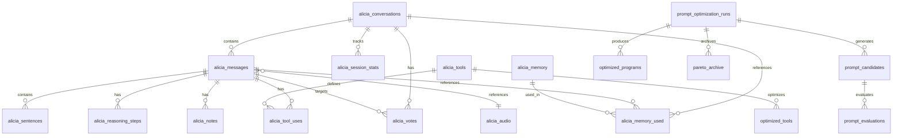

# Alicia Database Architecture

This document provides an overview of the Alicia database schema. For detailed documentation on individual tables, see the [database directory](./database/index.md).

## Quick Reference

The database uses PostgreSQL with the pgvector extension and contains 23 tables organized into seven categories.

### Core Conversation (4 tables)

| Table | Purpose |
|-------|---------|
| [alicia_conversations](./database/conversations.md) | Conversation containers with LiveKit room mapping |
| [alicia_messages](./database/messages.md) | Message content with offline sync support |
| [alicia_sentences](./database/sentences.md) | Sentence-level TTS streaming chunks |
| [alicia_audio](./database/audio.md) | Audio recordings with transcriptions |

### Memory System (2 tables)

| Table | Purpose |
|-------|---------|
| [alicia_memory](./database/memory.md) | Vector embeddings for RAG (1024 dimensions) |
| [alicia_memory_used](./database/memory_used.md) | Memory retrieval tracking |

### Tool System (2 tables)

| Table | Purpose |
|-------|---------|
| [alicia_tools](./database/tools.md) | Tool definitions with JSON schemas |
| [alicia_tool_uses](./database/tool_uses.md) | Tool execution records |

### Reasoning & Feedback (4 tables)

| Table | Purpose |
|-------|---------|
| [alicia_reasoning_steps](./database/reasoning_steps.md) | Chain-of-thought reasoning |
| [alicia_user_conversation_commentaries](./database/commentaries.md) | User comments |
| [alicia_votes](./database/votes.md) | Feedback voting (up/down/critical) |
| [alicia_notes](./database/notes.md) | Structured notes on messages |

### Infrastructure (3 tables)

| Table | Purpose |
|-------|---------|
| [alicia_meta](./database/meta.md) | Key-value metadata store |
| [alicia_mcp_servers](./database/mcp_servers.md) | MCP server configurations |
| [alicia_session_stats](./database/session_stats.md) | Session analytics |

### GEPA Optimization (5 tables)

See [GEPA Primer](./GEPA_PRIMER.md) for concepts.

| Table | Purpose |
|-------|---------|
| [prompt_optimization_runs](./database/prompt_optimization_runs.md) | Optimization run tracking |
| [prompt_candidates](./database/prompt_candidates.md) | Candidate prompts |
| [prompt_evaluations](./database/prompt_evaluations.md) | Evaluation results |
| [optimized_programs](./database/optimized_programs.md) | Final optimized prompts |
| [pareto_archive](./database/pareto_archive.md) | Pareto-optimal solutions |

### Tool Optimization (3 tables)

| Table | Purpose |
|-------|---------|
| [optimized_tools](./database/optimized_tools.md) | Optimized tool configurations |
| [tool_result_formatters](./database/tool_result_formatters.md) | Result formatting rules |
| [tool_usage_patterns](./database/tool_usage_patterns.md) | Usage analytics |

## Schema Diagram

## Enum Types

| Enum | Values |
|------|--------|
| `message_role` | `user`, `assistant`, `system` |
| `tool_status` | `pending`, `running`, `success`, `error`, `cancelled` |
| `conversation_status` | `active`, `archived`, `deleted` |
| `audio_type` | `input`, `output` |
| `sync_status` | `pending`, `synced`, `conflict` |
| `completion_status` | `pending`, `streaming`, `completed`, `failed` |
| `optimization_status` | `pending`, `running`, `completed`, `failed` |

## Common Patterns

### ID Prefixes

All IDs use prefixed random strings (e.g., `ac_xxx` for conversations, `am_xxx` for messages). See [ID Scheme](./ID_SCHEME.md).

### Soft Deletion

Most tables use `deleted_at TIMESTAMP` - queries should include `WHERE deleted_at IS NULL`.

### Timestamps

All tables include:
- `created_at` - Creation time
- `updated_at` - Auto-updated on changes via trigger

## Extensions

Required PostgreSQL extensions:
- `pgcrypto` - Random ID generation
- `vector` - Vector embeddings (pgvector)

## Related Documentation

- [Database Table Details](./database/index.md) - Complete table documentation
- [GEPA Primer](./GEPA_PRIMER.md) - Optimization concepts
- [Optimization System](./OPTIMIZATION_SYSTEM.md) - Optimization architecture
- [Offline Sync](./OFFLINE_SYNC.md) - Dual-ID synchronization
- [ID Scheme](./ID_SCHEME.md) - ID generation conventions
- [Protocol Database Alignment](./protocol/06-database-alignment.md) - Protocol to database mapping
