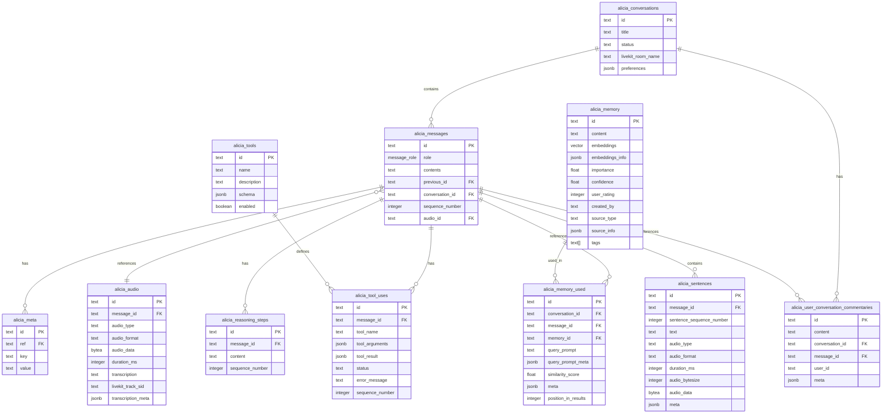

# Alicia Database Architecture

This document describes the database schema for the Alicia conversational AI system, detailing each table's purpose, fields, and relationships within the LiveKit-based real-time communication architecture.

## Database Schema Diagram



## Table Descriptions

### alicia_conversations

This table stores information about conversations with Alicia and their associated LiveKit rooms.

| Field | Type | Description | Relationships |
|-------|------|-------------|--------------|
| id | text | Primary key with 'ac' prefix | Referenced by alicia_messages.conversation_id |
| title | text | Descriptive title for the conversation | |
| status | text | Whether the conversation is active, archived, or other | |
| livekit_room_name | text | LiveKit room name for real-time communication | |
| preferences | jsonb | User preferences for this conversation (TTS settings, language, etc.) | |
| created_at | timestamp | When the conversation was created | |
| updated_at | timestamp | When the conversation was last updated | |
| deleted_at | timestamp | When the conversation was soft-deleted | |

**Purpose**: Serves as the top-level container for all messages in a conversation. The `livekit_room_name` field enables reconnection to the same LiveKit room for continued real-time communication. The preferences field allows for conversation-specific settings without needing a separate preferences table.

**LiveKit Integration**: Each conversation maps to a LiveKit room. When a user reconnects to a conversation, Alicia uses the stored `livekit_room_name` to join the appropriate room and resume real-time audio/data communication.

**Example Query**: Finding an active conversation with its LiveKit room:
```sql
SELECT id, title, livekit_room_name, preferences
FROM alicia_conversations
WHERE status = 'active'
  AND deleted_at IS NULL
  AND id = 'ac_12345';
```

### alicia_messages

This table stores individual messages in conversations.

| Field | Type | Description | Relationships |
|-------|------|-------------|--------------|
| id | text | Primary key with 'am' prefix | Referenced by alicia_messages.previous_id, alicia_tool_uses.message_id, alicia_reasoning_steps.message_id |
| conversation_id | text | The conversation this message belongs to | Foreign key to alicia_conversations.id |
| sequence_number | integer | Order of the message within the conversation | |
| previous_id | text | Reference to the previous message in the conversation | Foreign key to alicia_messages.id |
| message_role | role | Role of the message sender ('user', 'assistant', 'system') | |
| contents | text | The actual message content | |
| created_at | timestamp | When the message was created | |
| updated_at | timestamp | When the message was last updated | |
| deleted_at | timestamp | When the message was soft-deleted | |

**Purpose**: Stores the actual content of conversations. The linked list structure (previous_id) combined with sequence_number provides flexibility in message ordering while maintaining performance for sequential access.

**Example Query**: Retrieving conversation history in order:
```sql
SELECT id, message_role, contents, sequence_number, created_at
FROM alicia_messages
WHERE conversation_id = 'ac_12345'
  AND deleted_at IS NULL
ORDER BY sequence_number ASC;
```

### alicia_sentences

This table stores individual sentence chunks from messages, along with their audio data for streaming responses.

| Field | Type | Description | Relationships |
|-------|------|-------------|--------------|
| id | text | Primary key with 'ams' prefix | |
| message_id | text | Message this sentence belongs to | Foreign key to alicia_messages.id |
| sentence_sequence_number | integer | Order of the sentence within the message | |
| text | text | The sentence text content | |
| audio_type | text | Type of audio ('input' or 'output') | |
| audio_format | text | Format of the audio data ('wav', 'pcm', etc.) | |
| duration_ms | integer | Duration of the audio in milliseconds | |
| audio_bytesize | integer | Size of the audio data in bytes | |
| audio_data | bytea | The actual audio data for this sentence | |
| meta | jsonb | Additional metadata about the sentence and audio | |
| created_at | timestamp | When the sentence record was created | |
| updated_at | timestamp | When the sentence was last updated | |
| deleted_at | timestamp | When the sentence was soft-deleted | |

**Purpose**: Breaks down messages into individual sentences with their corresponding audio segments. This enables streaming text-to-speech output sentence by sentence over LiveKit data channels, providing progressive audio playback rather than waiting for the entire message audio to be generated. Each sentence chunk is transmitted as it becomes available, improving perceived responsiveness.

**LiveKit Integration**: As Alicia generates each sentence, the text and audio are sent via LiveKit data channels and simultaneously persisted to this table. This allows for real-time streaming while maintaining a complete record of the conversation.

**Example Query**: Retrieving all sentence chunks for a message in order:
```sql
SELECT sentence_sequence_number, text, duration_ms, audio_format
FROM alicia_sentences
WHERE message_id = 'am_67890'
  AND deleted_at IS NULL
ORDER BY sentence_sequence_number ASC;
```

### alicia_audio

This table stores audio data and metadata for user inputs and assistant outputs.

| Field | Type | Description | Relationships |
|-------|------|-------------|--------------|
| id | text | Primary key with 'aa' prefix | |
| message_id | text | id of alicia_messages | Reference to alicia_messages.id |
| audio_type | text | Type of audio ('input' or 'output') | |
| audio_format | text | Format of the audio data ('wav', 'pcm', 'opus', etc.) | |
| audio_data | bytea | The actual audio data | |
| duration_ms | integer | Duration of the audio in milliseconds | |
| transcription | text | Transcription of the audio content | |
| livekit_track_sid | text | LiveKit track SID for correlation with real-time streams | |
| transcription_meta | jsonb | Metadata about the transcription process | |
| created_at | timestamp | When the audio was recorded/created | |
| updated_at | timestamp | When the audio was last updated | |
| deleted_at | timestamp | When the audio was soft-deleted | |

**Purpose**: Stores audio recordings and their transcriptions. This table is primarily used for user-sent audio inputs that need to be transcribed and processed as user messages. The `livekit_track_sid` field allows correlation between the LiveKit real-time audio track and the persisted audio record.

**LiveKit Integration**: When a user speaks in a LiveKit room, their audio track is identified by a track SID. This SID is stored to enable correlation between the live stream and the persisted audio data, which is useful for debugging, analytics, and replay purposes.

**Example Query**: Finding audio records with their LiveKit track information:
```sql
SELECT id, message_id, audio_type, duration_ms, livekit_track_sid, transcription
FROM alicia_audio
WHERE message_id = 'am_11111'
  AND deleted_at IS NULL;
```

### alicia_memory

This table stores long-term memory for retrieval-augmented generation (RAG).

| Field | Type | Description | Relationships |
|-------|------|-------------|--------------|
| id | text | Primary key with 'amem' prefix | Referenced by alicia_memory_used.memory_id |
| content | text | The memory content | |
| embeddings | vector | Vector embeddings for semantic search | |
| embeddings_info | jsonb | Information about the embedding model and process | |
| importance | float | Importance score (0-1) for prioritizing memories | |
| confidence | float | Confidence score (0-1) in the memory's accuracy | |
| user_rating | integer | User rating of the memory's usefulness (1-5) | |
| created_by | text | Who created this memory | |
| source_type | text | Type of source ('conversation', 'document', etc.) | |
| source_info | jsonb | Detailed information about the memory source | |
| tags | text[] | Array of tags for categorization | |
| created_at | timestamp | When the memory was created | |
| updated_at | timestamp | When the memory was last updated (if applicable) | |
| deleted_at | timestamp | When the memory was soft-deleted | |

**Purpose**: Provides a vector database for semantic search and retrieval of relevant information during conversations. The importance and confidence scores enable better ranking of memories, while soft deletion allows for recovery of mistakenly deleted memories.

**Example Query**: Semantic search for relevant memories (using pgvector):
```sql
SELECT id, content, importance, confidence,
       1 - (embeddings <=> query_embedding) as similarity
FROM alicia_memory
WHERE deleted_at IS NULL
  AND importance > 0.5
ORDER BY embeddings <=> query_embedding
LIMIT 5;
```

### alicia_memory_used

This table tracks when and how memories are retrieved and used in conversations.

| Field | Type | Description | Relationships |
|-------|------|-------------|--------------|
| id | text | Primary key with 'amu' prefix | |
| conversation_id | text | Conversation where the memory was used | Foreign key to alicia_conversations.id |
| message_id | text | Message where the memory was used | Foreign key to alicia_messages.id |
| memory_id | text | The memory that was used | Foreign key to alicia_memory.id |
| query_prompt | text | The prompt used to query for this memory | |
| query_prompt_meta | jsonb | Metadata about the query process | |
| similarity_score | float | Similarity score between the query and memory | |
| meta | jsonb | Additional metadata about the memory usage | |
| position_in_results | integer | Position of this memory in the search results | |
| created_at | timestamp | When the memory was used | |
| updated_at | timestamp | When the memory was last updated | |
| deleted_at | timestamp | When the memory was soft-deleted | |

**Purpose**: Records which memories were retrieved and used during conversations, enabling analysis of the RAG system's effectiveness and providing context for improving memory retrieval algorithms.

**Example Query**: Analyzing memory usage patterns:
```sql
SELECT m.content, COUNT(*) as usage_count, AVG(mu.similarity_score) as avg_similarity
FROM alicia_memory_used mu
JOIN alicia_memory m ON mu.memory_id = m.id
WHERE mu.deleted_at IS NULL
  AND mu.created_at > NOW() - INTERVAL '30 days'
GROUP BY m.id, m.content
ORDER BY usage_count DESC
LIMIT 10;
```

### alicia_tools

This table defines the available tools that Alicia can use.

| Field | Type | Description | Relationships |
|-------|------|-------------|--------------|
| id | text | Primary key with 'at' prefix | Referenced by alicia_tool_uses.tool_name (via name field) |
| name | text | Unique name of the tool | |
| description | text | Human-readable description of what the tool does | |
| schema | jsonb | JSON schema defining the tool's input parameters | |
| enabled | boolean | Whether the tool is currently enabled for use | |
| created_at | timestamp | When the tool was registered | |
| updated_at | timestamp | When the tool definition was last updated | |
| deleted_at | timestamp | When the tool was soft-deleted | |

**Purpose**: Maintains a registry of available tools with their schemas and configurations. This enables dynamic tool discovery and validation of tool use requests.

**Example Query**: Listing all enabled tools:
```sql
SELECT name, description, schema
FROM alicia_tools
WHERE enabled = true
  AND deleted_at IS NULL
ORDER BY name;
```

### alicia_tool_uses

This table tracks tool usage and execution results.

| Field | Type | Description | Relationships |
|-------|------|-------------|--------------|
| id | text | Primary key with 'atu' prefix | |
| message_id | text | Message that triggered the tool use | Foreign key to alicia_messages.id |
| tool_name | text | Name of the tool that was used | Reference to alicia_tools.name |
| tool_arguments | jsonb | Arguments passed to the tool | |
| tool_result | jsonb | Result returned by the tool | |
| status | text | Status of the tool execution ('pending', 'success', 'error') | |
| error_message | text | Error message if the tool execution failed | |
| sequence_number | integer | Order of tool calls within a message | |
| completed_at | timestamp | When the tool execution was completed | |
| created_at | timestamp | When the tool was called | |
| updated_at | timestamp | When the tool was last updated | |
| deleted_at | timestamp | When the tool was soft-deleted | |

**Purpose**: Records all tool interactions, enabling analysis of tool usage patterns, debugging of tool-related issues, and reconstruction of the assistant's reasoning process.

**Example Query**: Finding failed tool executions for debugging:
```sql
SELECT tu.id, tu.tool_name, tu.error_message, tu.created_at, m.conversation_id
FROM alicia_tool_uses tu
JOIN alicia_messages m ON tu.message_id = m.id
WHERE tu.status = 'error'
  AND tu.deleted_at IS NULL
  AND tu.created_at > NOW() - INTERVAL '7 days'
ORDER BY tu.created_at DESC;
```

### alicia_reasoning_steps

This table stores the assistant's chain-of-thought reasoning steps.

| Field | Type | Description | Relationships |
|-------|------|-------------|--------------|
| id | text | Primary key with 'ar' prefix | |
| message_id | text | Message this reasoning belongs to | Foreign key to alicia_messages.id |
| content | text | The reasoning content | |
| sequence_number | integer | Order of reasoning steps within a message | |
| created_at | timestamp | When the reasoning was created | |
| updated_at | timestamp | When the reasoning was last updated | |
| deleted_at | timestamp | When the reasoning was soft-deleted | |

**Purpose**: Captures the assistant's step-by-step reasoning process, which can be interleaved with tool use. This provides transparency into how the assistant arrives at its responses and enables debugging of reasoning errors.

**Example Query**: Retrieving the complete reasoning chain for a message:
```sql
SELECT sequence_number, content, created_at
FROM alicia_reasoning_steps
WHERE message_id = 'am_54321'
  AND deleted_at IS NULL
ORDER BY sequence_number ASC;
```

### alicia_user_conversation_commentaries

This table stores user feedback and comments about conversations or specific messages.

| Field | Type | Description | Relationships |
|-------|------|-------------|--------------|
| id | text | Primary key with 'aucc' prefix | |
| content | text | The comment content | |
| conversation_id | text | Conversation this comment is about | Foreign key to alicia_conversations.id |
| message_id | text | Specific message this comment is about (optional) | Foreign key to alicia_messages.id |
| created_by | text | User who created the comment | |
| meta | jsonb | Additional metadata about the comment | |
| created_at | timestamp | When the comment was created | |
| updated_at | timestamp | When the comment was last updated | |
| deleted_at | timestamp | When the comment was soft-deleted | |

**Purpose**: Enables users to provide feedback on conversations or specific messages. This feedback can be used to improve the assistant's responses, identify issues, and track user satisfaction.

**Example Query**: Finding recent user feedback:
```sql
SELECT c.content, c.message_id, c.created_at, m.contents as message_content
FROM alicia_user_conversation_commentaries c
LEFT JOIN alicia_messages m ON c.message_id = m.id
WHERE c.conversation_id = 'ac_12345'
  AND c.deleted_at IS NULL
ORDER BY c.created_at DESC;
```

### alicia_meta

This table stores key-value metadata for various entities.

| Field | Type | Description | Relationships |
|-------|------|-------------|--------------|
| id | text | Primary key with 'amt' prefix | |
| ref | text | Reference to the entity this metadata belongs to | Foreign key to various tables |
| key | text | Metadata key | |
| value | text | Metadata value | |
| created_at | timestamp | When the metadata was created | |
| updated_at | timestamp | When the metadata was last updated | |
| deleted_at | timestamp | When the metadata was soft-deleted | |

**Purpose**: Provides a flexible way to store arbitrary metadata about messages, conversations, or other entities without modifying the schema. This enables tracking of processing metrics, user preferences, and other contextual information.

**Example Query**: Retrieving all metadata for a specific conversation:
```sql
SELECT key, value, created_at
FROM alicia_meta
WHERE ref = 'ac_12345'
  AND deleted_at IS NULL
ORDER BY key;
```

## Key Relationships

1. **Conversations and Messages**: A conversation contains multiple messages, ordered by sequence_number and linked via previous_id.

2. **Conversations and LiveKit Rooms**: Each conversation is associated with a LiveKit room via `livekit_room_name`, enabling real-time audio and data communication.

3. **Messages and Audio**: Messages can reference audio recordings. Audio records may include `livekit_track_sid` for correlation with LiveKit audio tracks.

4. **Messages and Sentences**: Messages are broken down into individual sentences, each with its own text and audio data, ordered by sentence_sequence_number. These are streamed over LiveKit data channels as they are generated.

5. **Messages and Tool Use/Reasoning**: Messages can have multiple tool use records and reasoning steps, which can be interleaved and ordered by sequence_number.

6. **Tools and Tool Uses**: Tool definitions in `alicia_tools` are referenced by executions in `alicia_tool_uses`, tracking which tools are available and how they are used.

7. **Memory and Usage**: Memories can be used in multiple messages, and each usage is tracked with context about the query and retrieval process.

8. **Metadata Flexibility**: The alicia_meta table can attach arbitrary metadata to any entity via the ref field, providing extensibility without schema changes.

## LiveKit Integration Architecture

The database schema supports Alicia's LiveKit-based real-time communication in several ways:

1. **Room Mapping**: The `livekit_room_name` field in `alicia_conversations` establishes a persistent connection between conversation state and LiveKit rooms. When a user reconnects, Alicia retrieves this field to join the correct room.

2. **Audio Track Correlation**: The `livekit_track_sid` field in `alicia_audio` links persisted audio data with LiveKit's real-time audio tracks, enabling:
   - Debugging of audio processing issues
   - Analytics on audio quality and duration
   - Replay and review of conversations

3. **Streaming Support**: The `alicia_sentences` table enables sentence-by-sentence streaming. As Alicia generates each sentence:
   - Text and audio are sent via LiveKit data channels
   - The same data is persisted to the database
   - Users receive immediate feedback while maintaining a complete record

4. **Real-time Tool Execution**: Tool uses are tracked with timestamps and status, allowing correlation between:
   - LiveKit data channel messages requesting tool execution
   - Database records of tool arguments and results
   - Real-time status updates sent back through LiveKit

5. **No Session State**: Unlike WebSocket-based architectures, the database does not need to track session state. LiveKit handles connection management, and the database focuses on conversation content and history.

## Design Principles

1. **Flexibility**: The schema uses JSON fields and the alicia_meta table to allow for extensibility without requiring schema changes.

2. **Traceability**: All actions and decisions are recorded with timestamps and sequence information, enabling detailed analysis and debugging.

3. **Independence with Relationships**: Entities like audio are independent but can be referenced by other entities, providing flexibility in how they're used.

4. **Soft Deletion**: Critical data uses soft deletion (deleted_at) rather than hard deletion, preventing accidental data loss.

5. **Vector Search**: The alicia_memory table uses pgvector for efficient semantic search, enabling retrieval-augmented generation.

6. **LiveKit Alignment**: The schema supports LiveKit's real-time communication model while maintaining a complete, queryable record of all conversations and interactions.

## Implementation Notes

- The schema requires PostgreSQL with the pgvector extension for vector embeddings.
- IDs use a generate_random_id function with prefixes to make them human-readable and distinguishable.
- JSON fields (jsonb) should be indexed appropriately for fields that will be frequently queried.
- Consider partitioning large tables (like alicia_messages or alicia_memory) by conversation_id or created_at for improved performance.
- All timestamp columns (created_at, updated_at, deleted_at) use the PostgreSQL 'timestamp' type without timezone.
- The `livekit_room_name` field should be indexed for fast lookup when users reconnect to conversations.
- The `livekit_track_sid` field enables correlation between live streams and persisted data, but is optional as not all audio records originate from LiveKit tracks.

## Example Workflows

### Starting a New Conversation

```sql
-- Create a new conversation with LiveKit room
INSERT INTO alicia_conversations (id, title, status, livekit_room_name, preferences)
VALUES ('ac_new123', 'Customer Support Chat', 'active', 'room_abc123', '{"tts_voice": "nova", "language": "en"}');

-- User sends first message (audio)
INSERT INTO alicia_audio (id, message_id, audio_type, audio_format, audio_data, duration_ms, livekit_track_sid, transcription)
VALUES ('aa_audio1', 'am_msg1', 'input', 'opus', <audio_bytes>, 3500, 'TR_track123', 'Hello, I need help with my account.');

INSERT INTO alicia_messages (id, conversation_id, sequence_number, message_role, contents)
VALUES ('am_msg1', 'ac_new123', 1, 'user', 'Hello, I need help with my account.');
```

### Streaming Assistant Response

```sql
-- Create assistant message
INSERT INTO alicia_messages (id, conversation_id, sequence_number, previous_id, message_role, contents)
VALUES ('am_msg2', 'ac_new123', 2, 'am_msg1', 'assistant', 'I''d be happy to help you with your account. What specific issue are you experiencing?');

-- Store sentence chunks as they're generated and streamed via LiveKit
INSERT INTO alicia_sentences (id, message_id, sentence_sequence_number, text, audio_type, audio_format, duration_ms, audio_data)
VALUES
  ('ams_s1', 'am_msg2', 1, 'I''d be happy to help you with your account.', 'output', 'pcm', 2100, <audio_bytes>),
  ('ams_s2', 'am_msg2', 2, 'What specific issue are you experiencing?', 'output', 'pcm', 1800, <audio_bytes>);
```

### Reconnecting to an Active Conversation

```sql
-- User reconnects - retrieve conversation and LiveKit room
SELECT id, title, livekit_room_name, preferences
FROM alicia_conversations
WHERE id = 'ac_new123'
  AND status = 'active'
  AND deleted_at IS NULL;

-- Retrieve recent message history
SELECT id, message_role, contents, sequence_number
FROM alicia_messages
WHERE conversation_id = 'ac_new123'
  AND deleted_at IS NULL
ORDER BY sequence_number DESC
LIMIT 10;
```
