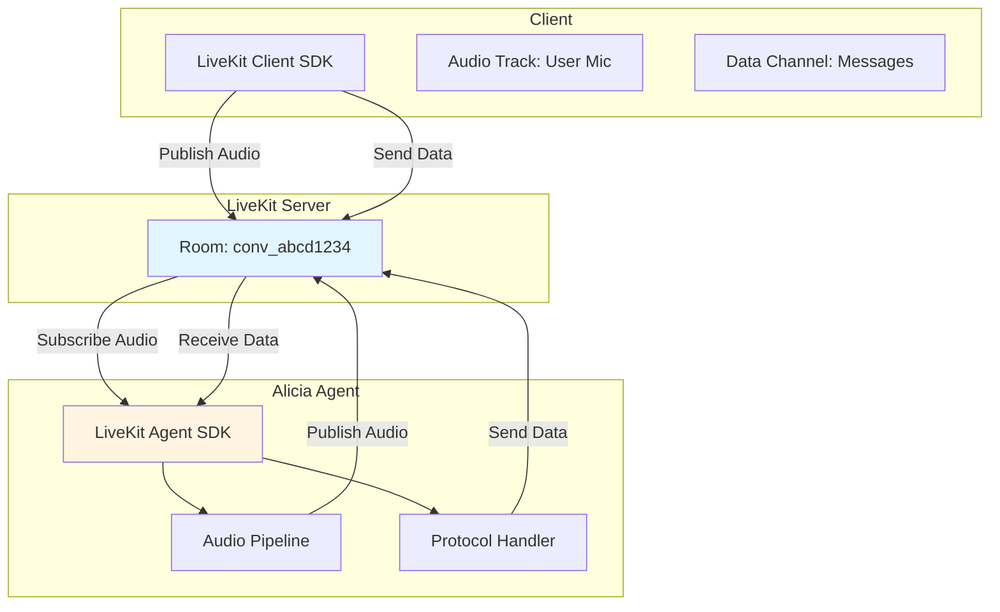

# LiveKit Integration

This document describes how Alicia integrates with LiveKit for real-time audio streaming and bidirectional data communication. LiveKit serves as the central communication backbone, handling all WebRTC transport, NAT traversal, and multi-platform support.

## Overview

Alicia uses LiveKit to enable real-time voice conversations between users and the AI agent. LiveKit provides:

- **Audio streaming**: Bidirectional Opus-encoded audio tracks (user microphone ↔ agent TTS)
- **Data channels**: MessagePack-encoded protocol messages for control and metadata
- **Multi-platform support**: Web (TypeScript), Android (Kotlin), CLI (Go) clients use the same infrastructure
- **Reliable transport**: Battle-tested WebRTC implementation with automatic reconnection

## Architecture



## Configuration

LiveKit requires several environment variables to be configured:

```bash
# LiveKit server connection
ALICIA_LIVEKIT_URL=ws://localhost:7880          # WebSocket URL for LiveKit server
ALICIA_LIVEKIT_API_KEY=devkey                   # API key for authentication
ALICIA_LIVEKIT_API_SECRET=secret                # API secret for token signing
```

**Production considerations**:
- Use `wss://` for production LiveKit URLs
- Store API credentials securely (never commit to version control)
- LiveKit Cloud or self-hosted deployments both supported

## Room Lifecycle

Each conversation in Alicia maps to exactly one LiveKit room, following a well-defined lifecycle.

### 1. Room Creation

When a user creates a new conversation, the backend creates a corresponding LiveKit room:

```go
// Room naming: conv_{conversationID}
roomName := fmt.Sprintf("conv_%s", conversationID)

room, err := livekitService.CreateRoom(ctx, roomName)
```

**Room configuration**:
- **Name**: `conv_{conversationID}` - matches conversation ID for easy mapping
- **EmptyTimeout**: 300 seconds - room closes 5 minutes after last participant leaves
- **MaxParticipants**: 2 - user and agent only
- **Metadata**: JSON object with `conversation_id` and `created_at`

### 2. Token Generation

Clients and agents need JWT tokens to join rooms. Tokens are scoped differently:

**Client tokens** (6-hour validity):
```go
token := livekitService.GenerateToken(roomName, userID, 6*time.Hour)
```

Grants: `RoomJoin`, `RoomList`, `CanPublish`, `CanSubscribe`

**Agent tokens** (24-hour validity):
```go
token := livekitService.GenerateToken(roomName, "alicia-agent", 24*time.Hour)
```

Grants: Same as client, plus extended validity for long-running agent processes

### 3. Agent Connection

The Alicia agent connects to the room and begins processing:

```go
agent, err := livekit.NewAgent(config, callbacks)
err = agent.ConnectToRoom(ctx, roomName, token)
```

**Connection flow**:
1. Agent receives room assignment (via gRPC or job queue)
2. Generates agent-scoped JWT token
3. Connects via LiveKit SDK (`lksdk.ConnectToRoom()`)
4. Subscribes to user's audio track
5. Publishes its own audio track for TTS output
6. Begins listening on data channel for messages

### 4. Room Cleanup

Rooms are automatically cleaned up when:
- All participants disconnect and EmptyTimeout expires
- Conversation is deleted (room explicitly destroyed)
- Agent process terminates gracefully

## Audio Track Handling

Audio is the primary modality for Alicia conversations. LiveKit handles all audio transport using Opus codec.

### Audio Configuration

- **Codec**: Opus (chosen by LiveKit for superior quality at low bitrates)
- **Sample rate**: 48kHz (LiveKit default, downsampled internally as needed)
- **Channels**: 2 (stereo, though most ASR/TTS uses mono)
- **Bitrate**: Adaptive (LiveKit manages based on network conditions)

### Publishing Audio (User → Agent)

Clients publish their microphone as an audio track:

**Web (React)**:
```typescript
const publishAudioTrack = async (track: MediaStreamTrack) => {
  await room.localParticipant.publishTrack(track, {
    name: 'microphone',
    source: Track.Source.Microphone,
  });
};
```

**Android (Kotlin)**:
```kotlin
val audioTrack = room.localParticipant.createAudioTrack("microphone")
room.localParticipant.publishAudioTrack(audioTrack)
```

### Subscribing to Audio (Agent receives User)

The agent automatically subscribes to the user's audio track:

```go
room.Callback.OnTrackSubscribed = func(
    track *webrtc.TrackRemote,
    publication *lksdk.RemoteTrackPublication,
    participant *lksdk.RemoteParticipant,
) {
    if track.Kind() != webrtc.RTPCodecTypeAudio {
        return
    }

    // Process incoming Opus frames
    go agent.processAudioTrack(track)
}
```

### PCM ↔ Opus Conversion

Internally, the agent converts between Opus (transport) and PCM (processing):

**Opus → PCM** (for ASR input):
```go
decoder := opus.NewDecoder(48000, 2)
pcmSamples := make([]int16, frameSize)
n, err := decoder.Decode(opusData, pcmSamples)
```

**PCM → Opus** (for TTS output):
```go
encoder := opus.NewEncoder(48000, 2, opus.AppVoIP)
opusData := make([]byte, maxPacketSize)
n, err := encoder.Encode(pcmSamples, opusData)
```

The `AudioConverter` component in `/internal/adapters/livekit/audio_converter.go` handles these conversions.

## Data Channel Protocol

While audio carries voice, the data channel carries all protocol messages using a binary MessagePack format.

### MessagePack Encoding

All messages are wrapped in an `Envelope` structure and encoded with MessagePack:

```go
type Envelope struct {
    StanzaID       int32       `msgpack:"stanzaId"`
    ConversationID string      `msgpack:"conversationId"`
    Type           MessageType `msgpack:"type"`
    Meta           map[string]interface{} `msgpack:"meta,omitempty"`
    Body           interface{} `msgpack:"body"`
}
```

**Encoding**:
```go
codec := livekit.NewCodec()
data, err := codec.Encode(envelope)
room.LocalParticipant.PublishData(data, lksdk.DataPublishOptions{Reliable: true})
```

**Decoding**:
```go
envelope, err := codec.Decode(data)
```

See `/internal/adapters/livekit/codec.go` for full implementation.

### Envelope Structure

**StanzaID**: Unique sequence number for message ordering
- **Client messages**: Positive, incrementing (1, 2, 3, ...)
- **Server messages**: Negative, decrementing (-1, -2, -3, ...)

**ConversationID**: Always `conv_{nanoid}` format, matching room name

**Type**: One of 16 message types (see protocol documentation)

**Body**: Message-specific payload (varies by type)

### Message Types

The protocol defines 16 core message types:

**Core Messages (1-16)**:
- `TypeErrorMessage` (1): Error notifications
- `TypeUserMessage` (2): User text input
- `TypeAssistantMessage` (3): Assistant text response
- `TypeAudioChunk` (4): Streaming audio data
- `TypeReasoningStep` (5): Chain-of-thought reasoning
- `TypeToolUseRequest` (6): Agent requests tool execution
- `TypeToolUseResult` (7): Tool execution result
- `TypeAcknowledgement` (8): Message receipt confirmation
- `TypeTranscription` (9): Speech-to-text result
- `TypeControlStop` (10): Interrupt current response
- `TypeControlVariation` (11): Request response variation
- `TypeConfiguration` (12): Session configuration
- `TypeStartAnswer` (13): Response streaming begins
- `TypeMemoryTrace` (14): Memory retrieval trace
- `TypeCommentary` (15): Meta-commentary on response
- `TypeAssistantSentence` (16): Complete sentence unit

**Feedback Messages (20-25)**:
- `TypeFeedback` (20): User feedback/votes
- `TypeFeedbackConfirmation` (21): Feedback acknowledged
- `TypeUserNote` (22): User annotation
- `TypeNoteConfirmation` (23): Note acknowledged
- `TypeMemoryAction` (24): Memory management action
- `TypeMemoryConfirmation` (25): Memory action confirmed

**Optimization Messages (29-31)**:
- `TypeDimensionPreference` (29): GEPA dimension preference
- `TypeEliteSelect` (30): User selects elite option
- `TypeEliteOptions` (31): Agent sends elite options

See `/pkg/protocol/messages.go` for complete definitions.

### Client vs Server StanzaIDs

StanzaIDs enable message ordering and acknowledgement tracking:

**Client behavior**:
```typescript
// Client maintains positive, incrementing stanza counter
let clientStanzaID = 1;

const sendMessage = (content: string) => {
  const envelope = {
    stanzaId: clientStanzaID++,  // 1, 2, 3, ...
    conversationId: conversationID,
    type: MessageType.UserMessage,
    body: { content }
  };

  const data = protocolService.encode(envelope);
  room.localParticipant.publishData(data);
};
```

**Server behavior**:
```go
// Agent maintains negative, decrementing stanza counter
lastStanzaID := int32(-1)

func sendMessage(envelope *protocol.Envelope) {
    envelope.StanzaID = lastStanzaID
    lastStanzaID-- // -1, -2, -3, ...

    data, _ := codec.Encode(envelope)
    room.LocalParticipant.PublishData(data, lksdk.DataPublishOptions{Reliable: true})
}
```

This separation prevents collisions and makes debugging easier.

## Reconnection Semantics

Alicia handles network interruptions gracefully using stanza tracking and message buffering.

### State Tracking

The conversation model tracks the last stanza IDs seen from each side:

```go
type Conversation struct {
    // ...
    LastClientStanzaID int32  // Last stanza received from client
    LastServerStanzaID int32  // Last stanza sent to client (negative)
    // ...
}
```

### Reconnection Flow

**1. Client reconnects**: After network interruption, client rejoins room

**2. Client sends sync request**: Includes last stanza IDs it received
```typescript
const syncMessage = {
  stanzaId: clientStanzaID++,
  conversationId,
  type: MessageType.Configuration,
  body: {
    lastServerStanzaId: -42,  // Last server message seen
  }
};
```

**3. Server replays missed messages**: Agent checks pending buffer
```go
// Find messages with stanzaID > lastClientStanzaID
missedMessages := messageBuffer.GetMessagesSince(lastClientStanzaID)
for _, msg := range missedMessages {
    agent.SendMessage(msg)
}
```

**4. Normal operation resumes**: Both sides now synchronized

### Message Buffer

The agent maintains a buffer of recent messages for replay:

```go
type MessageBuffer struct {
    messages []*PendingMessage
    maxSize  int
    mu       sync.RWMutex
}

func (mb *MessageBuffer) Add(msg *PendingMessage) {
    mb.mu.Lock()
    defer mb.mu.Unlock()

    mb.messages = append(mb.messages, msg)

    // Trim to max size (keep most recent)
    if len(mb.messages) > mb.maxSize {
        mb.messages = mb.messages[len(mb.messages)-mb.maxSize:]
    }
}
```

See `/internal/adapters/livekit/message_buffer.go` for implementation.

## Client Implementations

### React Client (Web)

**useLiveKit Hook** (`/frontend/src/hooks/useLiveKit.ts`):

```typescript
export const useLiveKit = (conversationId: string): UseLiveKitReturn => {
  const [room, setRoom] = useState<Room | null>(null);
  const [connected, setConnected] = useState(false);

  const connect = async () => {
    const token = await api.getLiveKitToken(conversationId);
    const livekitUrl = await getLiveKitURL();

    const newRoom = new Room({
      adaptiveStream: true,
      dynacast: true,
    });

    // Set up event handlers
    newRoom.on(RoomEvent.DataReceived, handleDataReceived);
    newRoom.on(RoomEvent.TrackSubscribed, handleTrackSubscribed);

    await newRoom.connect(livekitUrl, token);
    setRoom(newRoom);
    setConnected(true);
  };

  return { room, connected, connect, sendMessage, ... };
};
```

**Key features**:
- Automatic reconnection via LiveKit SDK
- Protocol message encoding/decoding
- Audio track management
- Connection state tracking

### Android Client

**LiveKitManager** (`/android/core/network/src/main/java/org/localforge/alicia/core/network/LiveKitManager.kt`):

```kotlin
class LiveKitManager(
    private val context: Context,
    private val apiService: ApiService
) {
    private var room: Room? = null

    suspend fun connect(conversationId: String) {
        val token = apiService.getLiveKitToken(conversationId)
        val url = apiService.getConfig().livekitUrl

        room = LiveKit.create(
            appContext = context,
            options = LiveKitOptions()
        ).apply {
            connect(url, token)

            // Subscribe to events
            events.collect { event ->
                when (event) {
                    is RoomEvent.DataReceived -> handleData(event.data)
                    is RoomEvent.TrackSubscribed -> handleTrack(event.track)
                    else -> {}
                }
            }
        }
    }
}
```

**Key features**:
- Kotlin coroutines for async operations
- Flow-based event handling
- Lifecycle-aware connection management

## Key Source Files

### Backend (Go)

- **Service Layer**:
  - `/internal/adapters/livekit/service.go` - Room management, token generation
  - `/internal/adapters/livekit/agent.go` - Agent connection and lifecycle
  - `/internal/adapters/livekit/agent_factory.go` - Agent instantiation

- **Protocol Handling**:
  - `/internal/adapters/livekit/codec.go` - MessagePack encoding/decoding
  - `/internal/adapters/livekit/protocol_handler.go` - Message type routing
  - `/internal/adapters/livekit/message_router.go` - Message dispatch
  - `/internal/adapters/livekit/message_dispatcher.go` - Message delivery
  - `/internal/adapters/livekit/message_buffer.go` - Reconnection buffer

- **Audio Processing**:
  - `/internal/adapters/livekit/voice_pipeline.go` - Audio buffering and processing
  - `/internal/adapters/livekit/audio_converter.go` - Opus ↔ PCM conversion

- **Response Generation**:
  - `/internal/adapters/livekit/response_generator.go` - LLM streaming handler
  - `/internal/adapters/livekit/worker.go` - Worker pool for event processing

### Frontend (TypeScript)

- `/frontend/src/hooks/useLiveKit.ts` - React hook for LiveKit integration
- `/frontend/src/services/protocol.ts` - Protocol encoding/decoding
- `/frontend/src/types/protocol.ts` - TypeScript protocol definitions

### Android (Kotlin)

- `/android/core/network/src/main/java/org/localforge/alicia/core/network/LiveKitManager.kt` - Android LiveKit wrapper

### Protocol Definitions

- `/pkg/protocol/envelope.go` - Envelope structure
- `/pkg/protocol/messages.go` - All 16 message types
- `/pkg/protocol/types.go` - Type constants and enums

## Common Patterns

### Sending a Message (Client)

```typescript
const sendMessage = async (content: string) => {
  const envelope = protocol.createEnvelope(
    clientStanzaID++,
    conversationId,
    MessageType.UserMessage,
    { content }
  );

  const data = protocol.encode(envelope);
  await room.localParticipant.publishData(data, { reliable: true });
};
```

### Receiving a Message (Client)

```typescript
room.on(RoomEvent.DataReceived, (payload: Uint8Array) => {
  const envelope = protocol.decode(payload);

  switch (envelope.type) {
    case MessageType.AssistantMessage:
      handleAssistantMessage(envelope.body);
      break;
    case MessageType.AudioChunk:
      handleAudioChunk(envelope.body);
      break;
    // ... other types
  }
});
```

### Sending a Message (Agent)

```go
func (a *Agent) SendMessage(envelope *protocol.Envelope) error {
    envelope.StanzaID = a.nextStanzaID()

    data, err := a.codec.Encode(envelope)
    if err != nil {
        return fmt.Errorf("failed to encode: %w", err)
    }

    err = a.room.LocalParticipant.PublishData(data, lksdk.DataPublishOptions{
        Reliable: true,
    })
    if err != nil {
        return fmt.Errorf("failed to publish: %w", err)
    }

    // Track for acknowledgement
    a.trackPendingMessage(envelope.StanzaID, data)

    return nil
}
```

## Performance Considerations

- **Opus encoding**: Hardware-accelerated on most devices, minimal CPU overhead
- **MessagePack**: ~3-5x smaller than JSON, faster parsing
- **Data channel reliability**: Reliable mode uses retransmission (adds latency under packet loss)
- **Audio latency**: Typically 100-300ms end-to-end (network + processing)
- **Reconnection time**: ~1-2 seconds to re-establish connection

## Troubleshooting

### Connection Issues

**Symptom**: Client can't connect to room
- Check LiveKit URL is correct and accessible
- Verify token is not expired (check JWT expiration)
- Ensure API key/secret match server configuration
- Check firewall allows WebSocket connections

### Audio Issues

**Symptom**: No audio heard from agent
- Verify agent has published audio track (`agent.audioTrack != nil`)
- Check client has subscribed to agent's track
- Ensure browser/device has granted microphone permissions
- Test with `room.participants` to see if agent is present

**Symptom**: Agent doesn't hear user
- Check user has published microphone track
- Verify agent's `OnTrackSubscribed` callback is firing
- Look for Opus decode errors in agent logs

### Protocol Issues

**Symptom**: Messages not being received
- Verify MessagePack encoding is correct (check with hexdump)
- Ensure message type is in registry (see `codec.go`)
- Check stanza IDs are incrementing correctly
- Look for errors in `OnDataReceived` callback

### Debugging Tools

**LiveKit Inspector**: Web UI for inspecting rooms and participants
```
http://localhost:7880/inspector
```

**Agent logs**: Enable debug logging
```go
log.SetLevel(log.DebugLevel)
```

**Network inspection**: Use browser DevTools Network tab
- Look for WebSocket connection to LiveKit
- Check for ICE candidate negotiation
- Monitor for unexpected disconnects

## See Also

- [Architecture Overview](ARCHITECTURE.md) - System-wide architecture
- [Conversation Workflow](CONVERSATION_WORKFLOW.md) - End-to-end message flow
- [Protocol Documentation](protocol/README.md) - Complete protocol specification
- [Database Schema](DATABASE.md) - Data models and persistence
