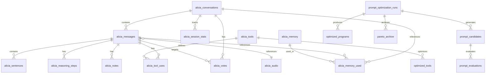

# Alicia Database Schema

This directory contains documentation for the Alicia database schema. The schema uses PostgreSQL with the pgvector extension for vector embeddings.

## Schema Overview

## Table Categories

### Core Conversation Tables

The foundational tables for storing conversations, messages, and related content.

| Table | Description | Doc |
|-------|-------------|-----|
| [alicia_conversations](./conversations.md) | Conversation containers with LiveKit room mapping | [Details](./conversations.md) |
| [alicia_messages](./messages.md) | Message content with offline sync support | [Details](./messages.md) |
| [alicia_sentences](./sentences.md) | Sentence-level streaming chunks with TTS audio | [Details](./sentences.md) |
| [alicia_audio](./audio.md) | Audio recordings with transcriptions | [Details](./audio.md) |

### Memory System

Vector-based long-term memory for retrieval-augmented generation.

| Table | Description | Doc |
|-------|-------------|-----|
| [alicia_memory](./memory.md) | Memory entries with vector embeddings | [Details](./memory.md) |
| [alicia_memory_used](./memory_used.md) | Memory retrieval tracking | [Details](./memory_used.md) |

### Tool System

Tool registry and execution tracking.

| Table | Description | Doc |
|-------|-------------|-----|
| [alicia_tools](./tools.md) | Tool definitions with JSON schemas | [Details](./tools.md) |
| [alicia_tool_uses](./tool_uses.md) | Tool execution records | [Details](./tool_uses.md) |

### Reasoning & Feedback

Chain-of-thought reasoning and user feedback.

| Table | Description | Doc |
|-------|-------------|-----|
| [alicia_reasoning_steps](./reasoning_steps.md) | Reasoning step content | [Details](./reasoning_steps.md) |
| [alicia_user_conversation_commentaries](./commentaries.md) | User comments on conversations | [Details](./commentaries.md) |
| [alicia_votes](./votes.md) | Feedback voting (up/down/critical) | [Details](./votes.md) |
| [alicia_notes](./notes.md) | Structured notes on messages | [Details](./notes.md) |

### Infrastructure

System configuration and metadata.

| Table | Description | Doc |
|-------|-------------|-----|
| [alicia_meta](./meta.md) | Flexible key-value metadata store | [Details](./meta.md) |
| [alicia_mcp_servers](./mcp_servers.md) | MCP server configurations | [Details](./mcp_servers.md) |
| [alicia_session_stats](./session_stats.md) | Session analytics | [Details](./session_stats.md) |

### GEPA Optimization

Tables supporting the [GEPA prompt optimization system](../GEPA_PRIMER.md).

| Table | Description | Doc |
|-------|-------------|-----|
| [prompt_optimization_runs](./prompt_optimization_runs.md) | Optimization run tracking | [Details](./prompt_optimization_runs.md) |
| [prompt_candidates](./prompt_candidates.md) | Candidate prompts during optimization | [Details](./prompt_candidates.md) |
| [prompt_evaluations](./prompt_evaluations.md) | Evaluation results | [Details](./prompt_evaluations.md) |
| [optimized_programs](./optimized_programs.md) | Final optimized prompts | [Details](./optimized_programs.md) |
| [pareto_archive](./pareto_archive.md) | Elite Pareto-optimal solutions | [Details](./pareto_archive.md) |

### Tool Optimization

Tables for optimizing tool descriptions and usage patterns.

| Table | Description | Doc |
|-------|-------------|-----|
| [optimized_tools](./optimized_tools.md) | Optimized tool configurations | [Details](./optimized_tools.md) |
| [tool_result_formatters](./tool_result_formatters.md) | Result formatting rules | [Details](./tool_result_formatters.md) |
| [tool_usage_patterns](./tool_usage_patterns.md) | Tool usage analytics | [Details](./tool_usage_patterns.md) |

## Enum Types

The schema defines these enum types:

| Enum | Values | Used By |
|------|--------|---------|
| `message_role` | `user`, `assistant`, `system` | alicia_messages |
| `tool_status` | `pending`, `running`, `success`, `error`, `cancelled` | alicia_tool_uses |
| `conversation_status` | `active`, `archived`, `deleted` | alicia_conversations |
| `audio_type` | `input`, `output` | alicia_audio, alicia_sentences |
| `sync_status` | `pending`, `synced`, `conflict` | alicia_messages |
| `completion_status` | `pending`, `streaming`, `completed`, `failed` | alicia_messages, alicia_sentences |
| `optimization_status` | `pending`, `running`, `completed`, `failed` | prompt_optimization_runs |

## Common Patterns

### ID Generation

All tables use prefixed random IDs generated by `generate_random_id(prefix)`:

| Prefix | Table |
|--------|-------|
| `ac_` | alicia_conversations |
| `am_` | alicia_messages |
| `ams_` | alicia_sentences |
| `aa_` | alicia_audio |
| `amem_` | alicia_memory |
| `amu_` | alicia_memory_used |
| `at_` | alicia_tools |
| `atu_` | alicia_tool_uses |
| `ar_` | alicia_reasoning_steps |
| `aucc_` | alicia_user_conversation_commentaries |
| `amt_` | alicia_meta |
| `amcp_` | alicia_mcp_servers |
| `av_` | alicia_votes |
| `an_` | alicia_notes |
| `ass_` | alicia_session_stats |
| `aor_` | prompt_optimization_runs |
| `apc_` | prompt_candidates |
| `ape_` | prompt_evaluations |
| `op_` | optimized_programs |
| `ot_` | optimized_tools |
| `trf_` | tool_result_formatters |
| `tup_` | tool_usage_patterns |
| `pa_` | pareto_archive |

### Soft Deletion

Most tables use `deleted_at TIMESTAMP` for soft deletion. Queries should include `WHERE deleted_at IS NULL`.

### Timestamps

All tables include:
- `created_at TIMESTAMP NOT NULL DEFAULT NOW()`
- `updated_at TIMESTAMP NOT NULL DEFAULT NOW()` (auto-updated via trigger)

## Related Documentation

- [GEPA Primer](../GEPA_PRIMER.md) - Prompt optimization concepts
- [Optimization System](../OPTIMIZATION_SYSTEM.md) - Optimization architecture
- [Offline Sync](../OFFLINE_SYNC.md) - Dual-ID synchronization strategy
- [ID Scheme](../ID_SCHEME.md) - ID generation conventions
- [Protocol Database Alignment](../protocol/06-database-alignment.md) - Protocol message to database mapping
