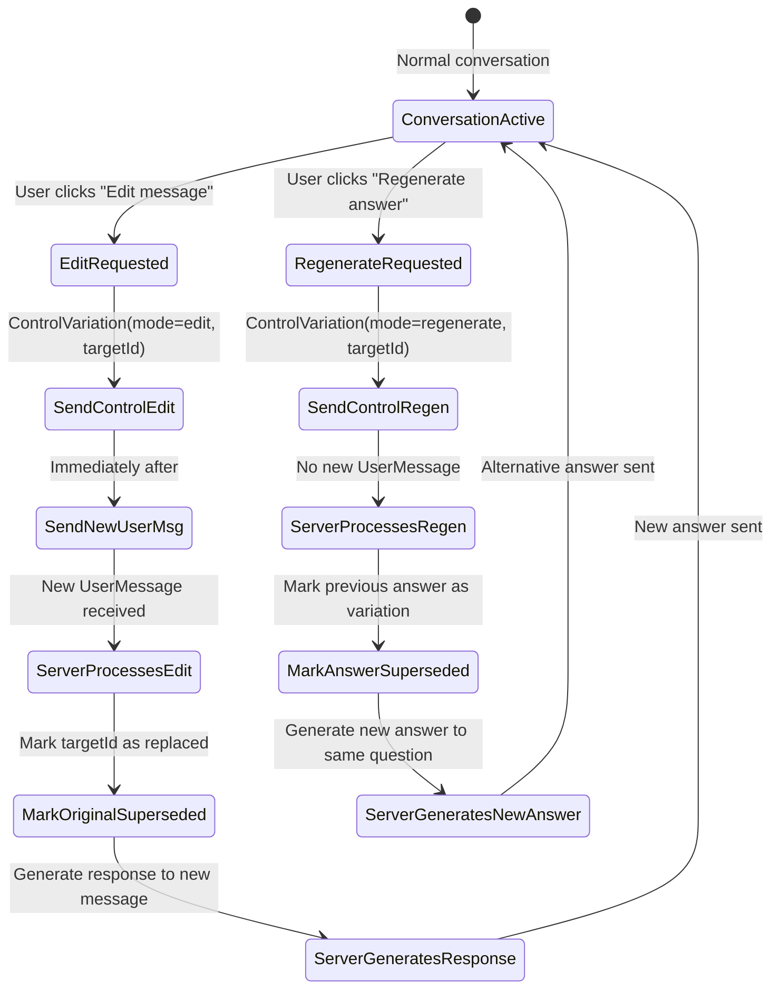

### 11. ControlVariation (Type 11)

**Purpose:** A control message indicating that the user wants to edit their previous message or regenerate the assistant's answer. This supports features like **message editing** and **answer regeneration** (retry/variation).

**Typical Direction:** Client → Server (via LiveKit data channel, when user triggers an edit or regenerate action).

**Fields:**

* `conversationId` (Text): Conversation ID (maps to LiveKit room name).
* `targetId` (Text, NanoID, REQUIRED): The ID of the user's message being referenced. This field is required to identify which message is affected. Typically, this is the NanoID of the last UserMessage the user sent (since most systems only allow editing the latest user turn, especially after getting a response).
* `mode` (Enum/Text, REQUIRED): Indicates the nature of the variation. This field is REQUIRED and MUST be one of the following values:

  * **`"edit"`** – The user has edited the content of their message. A new UserMessage with the edited content MUST follow this ControlVariation message. The original message (`targetId`) is marked as superseded, and the assistant responds to the new edited message.

  * **`"regenerate"`** – The user wants the assistant to generate a new answer to the same user message (without changing the question). No new UserMessage follows. The server uses the existing message referenced by `targetId` to generate a fresh response, potentially using different reasoning or variation in the answer. The previous assistant response is marked as superseded or moved to a variations collection.

  If this field is omitted or contains an unrecognized value, the server MUST reject the message with an Error (type 1).

**MessagePack Representation (Informative):**

Example for edit mode:
```
{
  "conversationId": "conv_7H93k",
  "targetId": "msg_u1A2B",
  "mode": "edit"
}
```

Example for regenerate mode:
```
{
  "conversationId": "conv_7H93k",
  "targetId": "msg_u1A2B",
  "mode": "regenerate"
}
```

**Mode Semantics:**

**Edit Mode (`mode: "edit"`):**

* **Purpose**: User has edited their previous message and wants the assistant to respond to the edited version.
* **Message Flow**:
  1. Client sends ControlVariation with `mode: "edit"` and `targetId` pointing to the original user message
  2. Client immediately sends a new UserMessage with the edited content (with a new message ID)
  3. Server marks the original message (`targetId`) as superseded/replaced
  4. Server marks any assistant response to the original message as superseded (if one exists)
  5. Server processes the new UserMessage and generates a response
* **Database Handling**: The original message is marked with a flag like `is_replaced: true` or `replaced_by_id: <new_message_id>`. The new message becomes the active message in the conversation.

**Regenerate Mode (`mode: "regenerate"`):**

* **Purpose**: User wants a different/alternative answer to the same question without changing the question itself.
* **Message Flow**:
  1. Client sends ControlVariation with `mode: "regenerate"` and `targetId` pointing to the user message to re-answer
  2. No new UserMessage is sent (the user's question remains the same)
  3. Server marks the previous assistant response as superseded/hidden (creating a variation/branch)
  4. Server generates a new response to the same user message (`targetId`)
* **Database Handling**: The assistant's previous response is marked as superseded or moved to an alternatives/variations collection. The new response gets a new message ID. Both responses may be kept for future reference (to show conversation branches or allow switching between variations).

**State Diagram:**



**Server Processing Requirements:**

When the server receives ControlVariation, it MUST:

1. **Validate the mode**: Ensure `mode` is either "edit" or "regenerate". If not, send an Error message (type 1).

2. **Validate targetId**: Verify that `targetId` references an existing user message in the conversation. If not found or if it references a non-user message, send an Error message.

3. **For `mode: "edit"`**:
   * Mark the message identified by `targetId` as superseded/replaced (e.g., `is_replaced: true`)
   * Cancel any ongoing processing related to the original message (similar to ControlStop)
   * Expect a new UserMessage to follow immediately (within a reasonable timeout, e.g., 5 seconds)
   * If the new UserMessage does not arrive within timeout, send an Error message
   * Once the new UserMessage arrives, mark the original message's `replaced_by_id` field
   * Mark any existing assistant response to the original message as superseded
   * Process the new UserMessage and generate a response

4. **For `mode: "regenerate"`**:
   * Do NOT expect a new UserMessage
   * Mark the previous assistant response (if any) as superseded or moved to a variations collection
   * Immediately begin generating a new response to the same user message (identified by `targetId`)
   * The new assistant response has a new message ID
   * Optionally, both the old and new responses may be retained for conversation branching features

**Database Alignment:** In the Alicia database, when a user message is edited, the old message is kept but marked with a flag like `is_replaced: true` or with a reference in `replaced_by_id` pointing to the new message. The new message is stored with a new ID. The commentary table may also be used to store edit metadata if needed.

For regeneration, the assistant's previous response is marked as superseded or moved to an alternatives/variations collection. The new response gets a new message ID. Both responses may be kept for future reference to support conversation branching features or to allow users to switch between variations.

The ControlVariation message itself may not be stored as part of conversation history (since it is a control event), but it may be logged for debugging or audit purposes via metadata tables. The key database changes are the flags and relationships it triggers on the user messages and assistant messages involved.
