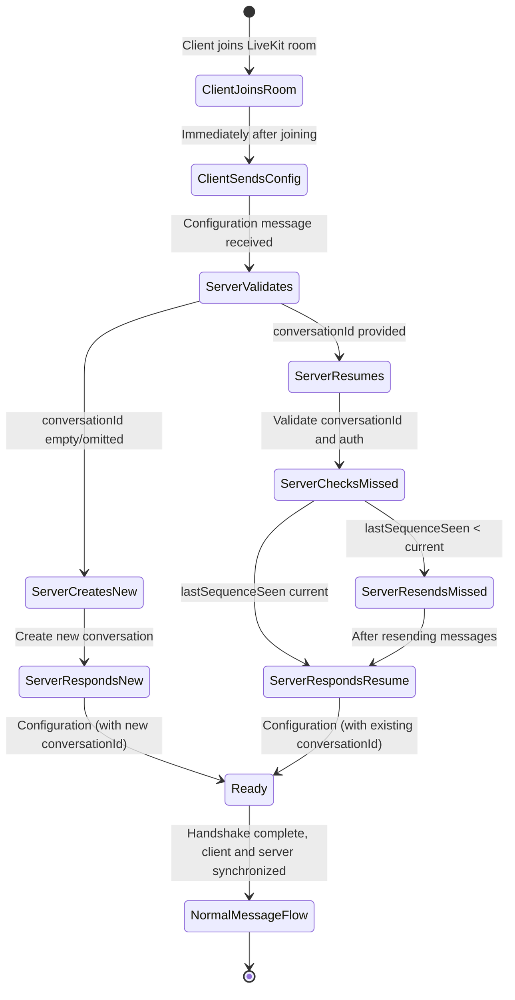

### 12. Configuration (Type 12)

**Purpose:** Initializes and configures the connection and conversation context. This message is the handshake that establishes conversation state after the client joins a LiveKit room. It handles conversation creation, resumption, and feature negotiation between client and server.

**Typical Direction:** Bidirectional (via LiveKit data channel). Client sends first after joining the LiveKit room, server MUST respond to complete the handshake.

**Fields:**

* `conversationId` (Text, optional on client request, REQUIRED on server response):
  * **Client → Server**: If the client wishes to **resume** an existing conversation, it MUST provide the `conversationId` of that conversation. This is an ID obtained from a previous session. If the client wants to start a new conversation, it SHOULD omit this field or set it to an empty string.
  * **Server → Client**: The server MUST include the `conversationId` in its response. For new conversations, this is a newly assigned ID. For resumed conversations, this is the existing conversation ID. **This conversationId maps to the LiveKit room name.**

* `lastSequenceSeen` (Int32, optional): The last stanza sequence number that the client has seen and processed in this conversation. This is REQUIRED when resuming (when providing a conversationId) and indicates the highest absolute stanza ID that the client received before disconnect. For example, if the client's log goes up to stanzaId 12, then `lastSequenceSeen = 12`. For brand new conversations (no prior messages), this is 0 or omitted. The server uses this to determine which messages need to be resent.

* `lastStanzaMap` (Map, optional): A map for fine-grained resumption information. This optional field allows specifying exactly which messages were received for different streams or contexts. The map keys are message IDs or categories, and values are offsets. While `lastSequenceSeen` covers overall ordering, `lastStanzaMap` can be used for more complex scenarios like partially received multi-part messages. Most implementations do not need this field.

* `clientVersion` (Text, optional): The version of the client software. Useful for logging and conditional behavior based on client capabilities.

* `preferredLanguage` (Text, optional): The user's preferred language or locale (can influence assistant responses or speech recognition language).

* `device` (Text, optional): Information about the client device (like "web", "mobile-ios", "desktop"). This can also be conveyed in metadata.

* `features` (Array of Strings, optional): Feature flags indicating capabilities the client supports. Examples: "audio_output", "reasoning_step_display", "partial_transcripts", "streaming". The server uses this to determine which message types to send. For instance, if the client cannot handle streaming, the server uses non-streaming AssistantMessage instead of StartAnswer + AssistantSentence.

* `enableReordering` (Bool, optional): Whether the client can handle out-of-order message processing. Typically not needed since Alicia maintains strict ordering.

**MessagePack Representation (Informative):**

Client request (new conversation):
```
{
  "lastSequenceSeen": 0,
  "clientVersion": "1.0.3",
  "preferredLanguage": "en-US",
  "device": "web",
  "features": ["audio_output", "reasoning_step_display", "streaming"]
}
```

Client request (resuming conversation):
```
{
  "conversationId": "conv_7H93k",
  "lastSequenceSeen": 12,
  "clientVersion": "1.0.3",
  "preferredLanguage": "en-US",
  "device": "web",
  "features": ["audio_output", "reasoning_step_display", "streaming"]
}
```

Server response (new conversation):
```
{
  "conversationId": "conv_7H93k",
  "features": ["streaming", "tool_use", "reasoning_steps"]
}
```

Server response (resumed conversation):
```
{
  "conversationId": "conv_7H93k",
  "lastSequenceSeen": 15,
  "features": ["streaming", "tool_use", "reasoning_steps"]
}
```

**Semantics (Handshake Protocol):**

**Connection Flow:**

1. Client joins LiveKit room
2. Client immediately sends Configuration message over the data channel
3. Server MUST respond with its own Configuration message
4. Normal message flow begins

**For New Conversations:**

* Client sends Configuration with empty/omitted `conversationId` and `lastSequenceSeen: 0`
* Server creates a new conversation and assigns a new `conversationId` (typically a NanoID)
* **The conversationId maps to the LiveKit room name**
* Server responds with Configuration containing the newly assigned `conversationId`
* Client stores this `conversationId` for future resumption

**For Resuming Conversations:**

* Client sends Configuration with the existing `conversationId` and `lastSequenceSeen` set to the highest stanza ID it has
* Server verifies the conversation exists and the client is authorized to access it
* Server determines if there are missed messages (messages with stanzaId > client's `lastSequenceSeen`)
* Server responds with Configuration and then retransmits any missed messages in order
* For example, if conversation has messages up to sequence 15 and client's `lastSequenceSeen` is 12, server resends messages 13, 14, 15

**Configuration Handshake State Machine:**



**Mandatory Server Response:**

The server MUST respond to every client Configuration message with its own Configuration message. This response MUST include:

* The `conversationId` (either the resumed conversation ID or newly assigned one for new conversations)
* Server capabilities in the `features` field
* Acknowledgement of received client features and preferences

This ensures both client and server are synchronized on the conversation context before any other messages are exchanged.

**Mid-Conversation Configuration Updates:**

If the client sends a Configuration message after the initial handshake (when the connection is already initialized), the server handles it as follows:

* **If `conversationId` matches the current active conversation**: The server treats this as a configuration update request (e.g., feature toggles, preference changes). The server MUST respond with a Configuration message acknowledging the changes.
* **If `conversationId` differs from the current active conversation**: The server MUST reject the request with an Error message (type 18) indicating that switching conversations requires a new connection or explicit conversation switch protocol.
* The server MAY reject redundant Configuration messages if no changes are detected.

The server might also send a Configuration message mid-conversation to push updated settings or information to the client (for example, to notify the client it is switching models or that context was modified). The client SHOULD acknowledge receipt if required by the server.

**ConversationId and LiveKit Room Mapping:**

**The conversationId directly maps to the LiveKit room name.** When a new conversation is created, the server assigns a conversationId and this becomes the identifier for the LiveKit room. When resuming, the client rejoins the LiveKit room with the same name as the conversationId. This 1:1 mapping ensures that conversation state and real-time communication context are aligned.

**Database Alignment:**

The Configuration handshake ties directly into the `alicia_user_conversations` table (or similar), which stores conversation metadata like user ID, creation time, last active time, etc. When processing Configuration:

* If `conversationId` is new, the server creates a new conversation entry with that ID
* If resuming, the server updates the "last_active" timestamp
* The `lastSequenceSeen` field is runtime state and is not stored persistently
* Features and preferences can be stored in a conversation settings table or metadata (for example, if the user sets their preferred language, that is saved)
* The `alicia_meta` table may store handshake-related data like device info or client version (keyed to conversation or user)

The Configuration message itself is not stored as conversation content, but the metadata it contains may be persisted for session management and analytics purposes.
