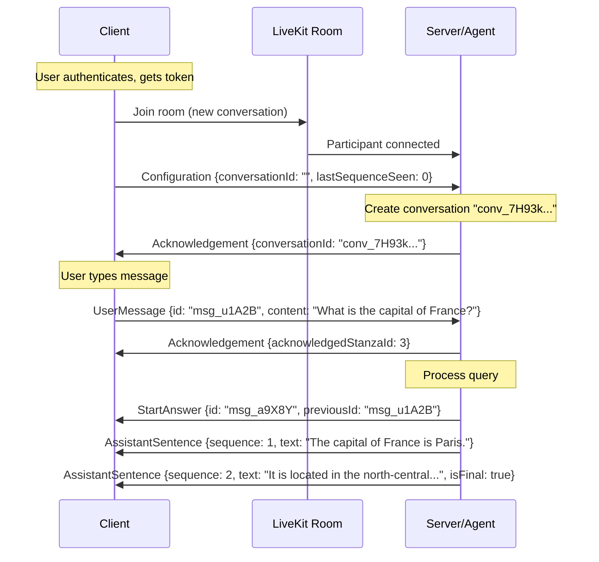
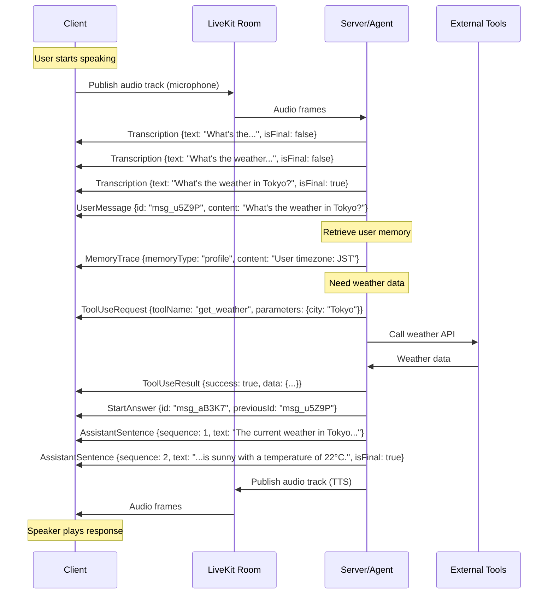
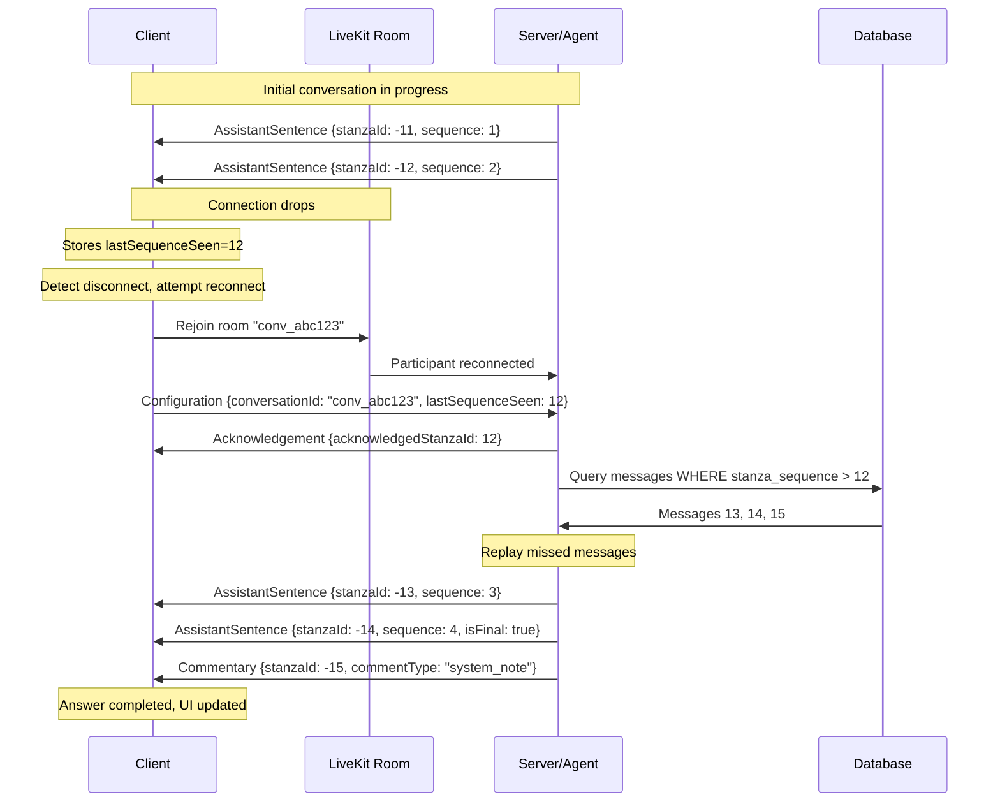
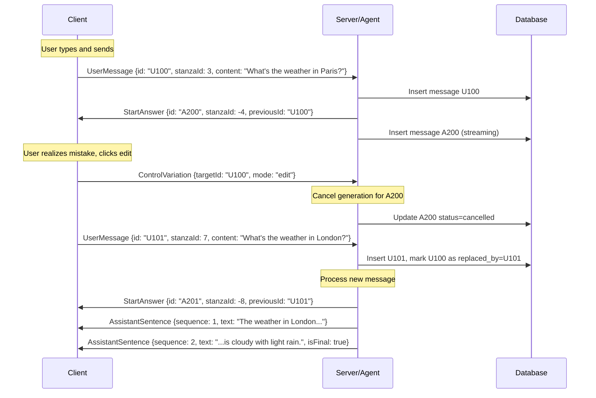

## Example Sessions

This section illustrates how the Alicia protocol operates in practice using LiveKit as the transport layer. Each example includes narrative description and sequence diagrams.

## Example 1: Basic Text Q&A

This example shows a simple text conversation with streaming response.

### Narrative

**Setup:**
* User has already authenticated and received a LiveKit access token
* Client joins LiveKit room for a new conversation

**Flow:**

1. **Client joins LiveKit room** using the SDK with the access token
2. **Client sends Configuration** message over the data channel with no `conversationId` (indicating new conversation), `lastSequenceSeen: 0`
3. **Server creates conversation**, assigns `conversationId = "conv_7H93k..."`, and responds with Acknowledgement
4. **User types message**: "What is the capital of France?"
5. **Client sends UserMessage** with content, generates NanoID `msg_u1A2B`, sets `previousId: null` (first message)
6. **Server acknowledges** receipt with Acknowledgement message
7. **Server begins generating response**, sends StartAnswer with `id: "msg_a9X8Y"`, `previousId: "msg_u1A2B"`
8. **Server streams response** as AssistantSentence messages:
   - Sentence 1: "The capital of France is Paris."
   - Sentence 2: "It is located in the north-central part of the country." (isFinal: true)
9. **Conversation continues** or awaits next user message

### Sequence Diagram

## Example 2: Voice Conversation

This example demonstrates a complete voice interaction with audio tracks and transcription.

### Narrative

**Setup:**
* Client has joined LiveKit room for existing conversation
* Microphone and speaker are configured

**Flow:**

1. **User speaks** into microphone
2. **Client publishes audio track** to LiveKit room (microphone input)
3. **Server receives audio** via subscribed track
4. **Server transcribes** in real-time, sends Transcription messages:
   - Partial: "What's the..." (isFinal: false)
   - Partial: "What's the weather..." (isFinal: false)
   - Final: "What's the weather in Tokyo?" (isFinal: true)
5. **Server creates UserMessage** from final transcription with `id: "msg_u5Z9P"`
6. **Server retrieves memory** about user's timezone preference, sends MemoryTrace
7. **Server calls weather tool**, sends ToolUseRequest and ToolUseResult
8. **Server generates response**, sends StartAnswer with `id: "msg_aB3K7"`
9. **Server streams text response** as AssistantSentence messages
10. **Server streams audio response** via TTS over audio track
11. **Client plays audio** from subscribed assistant audio track

### Sequence Diagram

## Example 3: Reconnection Mid-Answer

This example shows how reconnection works when the connection drops during a streaming response.

### Narrative

**Initial State:**
* Conversation `conv_abc123` is active
* Server has sent messages up to stanzaId -12 (second sentence of an answer)
* Client receives up to stanzaId -12, then connection drops

**Reconnection Flow:**

1. **Connection drops** (network issue)
2. **Client detects disconnection**, stores `lastSequenceSeen: 12`
3. **Client rejoins LiveKit room** with same conversation identifier
4. **LiveKit restores connection** and resubscribes to audio tracks
5. **Client sends Configuration** with `conversationId: "conv_abc123"`, `lastSequenceSeen: 12`
6. **Server acknowledges** with Acknowledgement
7. **Server checks database** and finds messages 13-15 were not delivered:
   - Message -13: AssistantSentence (sequence 3)
   - Message -14: AssistantSentence (sequence 4, final)
   - Message -15: Commentary
8. **Server replays** missing messages in order
9. **Client receives** remaining sentences and completes the answer display
10. **Conversation continues** seamlessly

### Sequence Diagram

## Example 4: Message Editing with ControlVariation

This example demonstrates how users can edit their messages and trigger a new response.

### Narrative

**Initial State:**
* User has sent a message asking about Paris weather
* Server has started generating a response

**Edit Flow:**

1. **User sends message**: "What's the weather in Paris?" (UserMessage `id: "U100"`, stanzaId 3)
2. **Server sends StartAnswer** (`id: "A200"`, stanzaId -4, previousId: "U100")
3. **User realizes mistake** and wants to ask about London instead
4. **Client sends ControlVariation** with `targetId: "U100"`, `mode: "edit"`
5. **Client sends new UserMessage**: "What's the weather in London?" (UserMessage `id: "U101"`, stanzaId 7)
6. **Server receives ControlVariation**, marks message U100 as replaced, cancels generation for A200
7. **Server receives new UserMessage U101**, begins processing
8. **Server sends new StartAnswer** for London weather (`id: "A201"`, stanzaId -8, previousId: "U101")
9. **Server streams response** about London weather
10. **Database reflects** U100 is replaced by U101, A200 is cancelled, A201 is active

### Sequence Diagram

## Example 5: Multi-Turn Conversation with Memory

This example shows how memory is retrieved and used across multiple turns.

### Narrative

**Turn 1:**
1. User: "My favorite color is blue"
2. Server stores this as a memory preference
3. Server responds: "I'll remember that your favorite color is blue"

**Turn 2 (later in conversation):**
1. User: "What colors should I use for my website?"
2. Server retrieves memory about favorite color
3. Server sends MemoryTrace indicating the preference was retrieved
4. Server responds: "Since blue is your favorite color, I recommend using shades of blue..."

### Sequence Diagram

## Example 6: Error Handling and Retry

This example demonstrates error handling when a tool fails.

### Narrative

1. **User asks**: "What's the latest news?"
2. **Server calls news API tool**, but the API is down
3. **Server sends ToolUseRequest** and **ToolUseResult** with `success: false`
4. **Server sends ErrorMessage** explaining the tool failure
5. **Server attempts fallback**: sends response without real-time news
6. **User retries**: sends ControlVariation with `mode: "retry"`
7. **Server tries again**, this time the API succeeds
8. **Server sends successful response** with news

### Sequence Diagram

## Implementation Notes

### Message Flow over LiveKit

All protocol messages in these examples flow through LiveKit:

**Data Channel:**
* Configuration, UserMessage, AssistantSentence, ToolUseRequest, ToolUseResult, MemoryTrace, Commentary, ControlVariation, ErrorMessage, Acknowledgement
* Sent as MessagePack-encoded binary over LiveKit's reliable data channel

**Audio Tracks:**
* User microphone input: Published as audio track by client
* Assistant TTS output: Published as audio track by server
* Automatically managed by LiveKit (subscription, buffering, playback)

**Room Management:**
* Each conversation maps to one LiveKit room
* Room name typically matches conversationId
* Access controlled via JWT tokens

### StanzaId Sequencing

In all examples:
* **Client messages** use positive odd numbers: 1, 3, 5, 7...
* **Server messages** use negative even numbers: -2, -4, -6, -8...
* **Monotonically increasing** (absolute values)
* Used for ordering and reconnection tracking

### Database Persistence

Each protocol message corresponds to database operations:
* UserMessage → Insert into `alicia_messages` with `role='user'`
* AssistantSentence → Insert into `alicia_sentences`, aggregate to `alicia_messages`
* MemoryTrace → Insert into `alicia_memory_used`
* ToolUseRequest/Result → Insert/update in `alicia_tool_uses`
* Commentary → Insert into `alicia_commentaries`

The database maintains a complete record while LiveKit provides real-time delivery.

## Testing These Scenarios

Implementers should test each example scenario to ensure:

1. **Basic Q&A**: Text messages flow correctly, streaming works
2. **Voice**: Audio tracks publish/subscribe correctly, transcription integrates
3. **Reconnection**: Message replay works, no duplicates, audio tracks restore
4. **Editing**: ControlVariation properly cancels and replaces
5. **Memory**: Retrieval and logging work across turns
6. **Errors**: Graceful degradation, retry mechanisms function

These examples cover the core protocol patterns and should serve as templates for building comprehensive test suites.
